# Changelog

## Friday, February 25

### Customization For Logging Events

You can now customize the specific events that are logged in your moderation, members & action log channels using the `/logging configure` command!

This allows you to disable events you don't need logged making it easier to keep your logs clean and only containing what's important to your community.

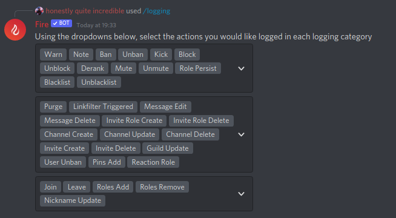

## Thursday, February 24

### Rewritten Link Filter Exclusion

After `/filterexcl` being disabled for months, I've finally rewritten it and re-enabled the command.

The command has a new home too! It is now usable via `/linkfilter exclude` (and two new context menu items, one for users & one for messages)

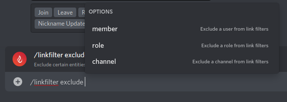 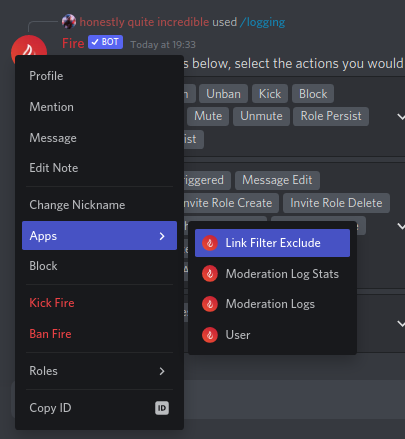 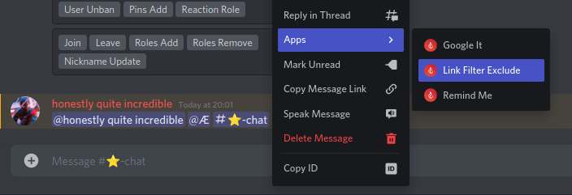

Toggling link filters has moved from `/linkfilter` -> `/linkfilter toggle` 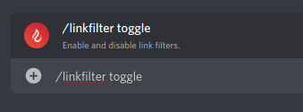

If you thought I was done with the new commands then boy do I have something for you!

You can now list exclusions without having to (un)exclude anyone or anything from the filter using `/linkfilter list-exclude`!

&#x20;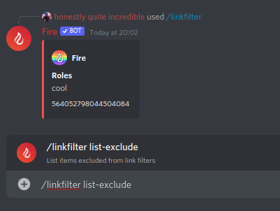

### Buttons For Bot Links

This was something small I had snuck in during the rewrite of `/linkfilter exclude`.

When running `/user` or the `User` context command on a bot, you may see some new buttons in the response...

The terms of service & privacy policy links are now buttons and I've also added a quick `Add to Server` button which functions the same as the one on the bot's profile, if the developer has set it up.

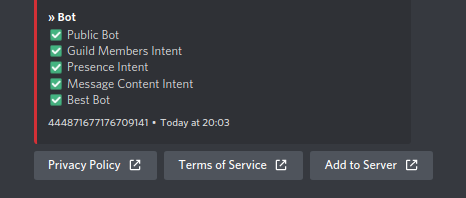

### Less False Triggers For Minecraft Log Scanning

Fire will now check to see if the content of a message contains a codeblock with a language specified and will ignore it for log scanning if one is found.

This should help prevent false triggers of the system when code is posted.

### #StandWithUkraine

I'm sure you're aware of everything happening with Russia and Ukraine by now so I want to take this time to ask that if you can, you can check the various links below to donate and help various charities supporting Ukraine with the horrible things happening there ❤🇺🇦

https://voices.org.ua/en/ https://savelife.in.ua/en/donate/ https://www.rsukraine.org/ https://armysos.com.ua/en/

## Thursday, February 17

### Updated Anti Command

The `/anti` command, which is used to toggle basic message filters, has been updated to use buttons instead of a command argument.

This makes it much easier to use and allows toggling filters with a single click

You can check out a demo of the new command [here](https://static.inv.wtf/updated\_anti\_command.mp4)

If you have any suggestions for new message filters, you can let me know in the [Fire Discord](https://inv.wtf/fire)

### Updated Linkfilter Command

Keeping with the trend of message filters, the `/linkfilter` command has been updated to use a dropdown instead of a command argument.

This allows you to easily toggle multiple filters at once and disable them all by selecting the `Disable All Filters` option.

You can check out a demo of the new command [here](https://static.inv.wtf/updated\_linkfilter\_command.mp4)

If you have any suggestions for other link filters, you can let me know in the [Fire Discord](https://inv.wtf/fire)

## Tuesday, February 15

### Editing Tags with Modals

The `Edit Tag` button in the `/tag info` command will now open a modal for you to rename the tag and edit the content.

The `/tag edit` command will switch to using this modal in the future once more users have updated to newer versions of the Discord client

### Carbon Now Uses Modals

Another area of Fire now using modals is the `/carbon` commnd. You now only select the theme & font in the command and you will be presented with a modal to enter your code.

## Saturday, February 12

### Bug Fixes

Issues with slash tags responding saying "Command not found" and snoozing reminders have been fixed.

## Thursday, February 10

### Modals

Discord has released a new interaction response type, modals!

Unfortunately I was not part of the beta for this feature so this is the first time I've broken the tradition of having new features on day one. (They released on the 9th at midnight, I added them to Fire on the 10th at 8pm)

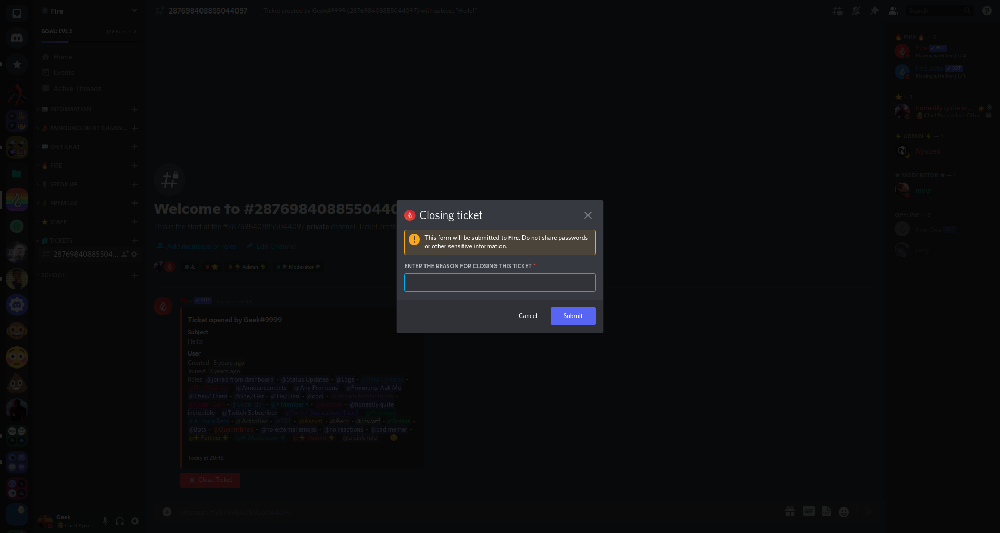

This is just the first place they'll be used in Fire with more coming soon.

Make sure you update your client so you can see the new modals!

## Friday, January 21

### Premium Discounts

You can now get exclusive discount codes when boosting the [Fire Discord](https://inv.wtf/fire) and/or subscribing to Geek, the developer of Fire on [Twitch](https://inv.wtf/twitch)

To claim your discount code, you can use the `/discount` command in the Fire Discord to claim a discount code for premium ranging from 35% off up to 75% off!

You get 35% off by boosting, 50% off by subscribing and 75% off if you are both a booster and subscriber!

The discount code expires after 24 hours and you will only see it once so make sure to take note of it after running the command. The discount lasts until you leave the server or unboost/unsubscribe

## Sunday, January 2 (Start of 2022!!!)

Happy new year! 🎉

2021 was an amazing year for Fire and I hope 2022 will be even better.

I have a couple changes, including a very popular feature now being available to the general public with premium!

### New Website Beta

The current Fire website hasn't been worked on in quite a while and is pretty broken. This is because my good friend and amazing web developer, [bruno](https://bruno.codes) has been working on an updated version.

I am happy to say that I've now made this ongoing rewrite accessible at [getfire.bot](https://getfire.bot) for users to try out!

It may be buggy and is currently not great on mobile so if you encounter any bugs or have any questions/suggestions, please let me know in the [#fire-help channel](https://canary.discord.com/channels/564052798044504084/564067823014641664) in the [Fire Discord server](https://inv.wtf/fire).

As a little treat for helping test the new website, you can use code `NEWYEAR22` to get 22% off Fire Premium (valid until January 31st at 23:59 UTC), which you can purchase through the website by logging in, clicking your avatar and selecting `Premium` in the dropdown menu. This new system for buying premium requires no manual intervention from me unlike the current one and allows you to select the server(s) you want premium in on the website!

I hope you enjoy the new website!

### Renamed Commands

The `/mcuuid` and `/skin` commands have been moved to subcommands of `/minecraft`

To use these commands, it is now `/minecraft uuid <ign>` and `/minecraft skin <ign>` respectively.

### Minecraft Log Scanning

Keeping to the block game theme, this highly popular feature seen in servers like Sk1er's Epic Server, ESSENTIAL Mod, Skytils & more is now available to the general public!

This feature requires premium as it is quite resource intensive with it potentially loading a couple megabytes worth of data into memory, running many regexes on it and then checking for known solutions and recommendations by matching strings.

It can be enabled with `/minecraft log-scan` and works with attachments, select pastebin/hastebin service links & sending the text directly.

If you have any questions about or find any issues with this feature, please let me know in the #premium-support channel in the [Fire Discord server](https://inv.wtf/fire). You can also help improve this feature by providing sample logs and the matching solutions or recommendations in this channel.

## Monday, December 20

It's been a while since the last changelog entry but that doesn't mean I haven't been busy...

I've mostly been working on improving Fire's slash commands in preparation of going slash only 👀

You can see all the changes in [Fire Beta](https://inv.wtf/betabot) though do note that the beta is, well, still in beta so I would recommend not replacing Fire with the beta.

Anyways, time for the things you came here for, the production bot changes!

### Timeouts

Discord has _finally_ added a native muting solution and in true Fire fashion, it already has support for it!!!

Unfortunately, they are limited to 28 days in the future so for longer mutes, the `Muted` role (or whichever role you set with the `/muterole` command) will still be used.

This change also comes with the removal of the minimum time for mutes

N.B.: To make use of timeouts, Fire will need the **Moderate Members** permission so if it isn't using timeouts, make sure to check your muting for less than 28 days and it has the appropriate permission.

## Wednesday, October 20

### Changes to quote appearance

Quotes will now use your server profile (nickname & server avatar) rather than your global avatar and _only_ your username.

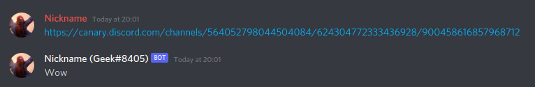

Thanks to [UserTeemu](https://github.com/UserTeemu) for submitting [this change](https://github.com/FireDiscordBot/bot/pull/117)!

## Friday, October 1

### New Help Command

Fire's help command has been updated to be much more clean and concise rather than the large embed it used to be.

Now you can use the dropdown menu to select a command category rather than seeing them all at once.

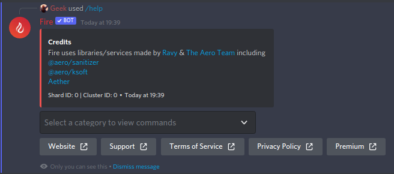 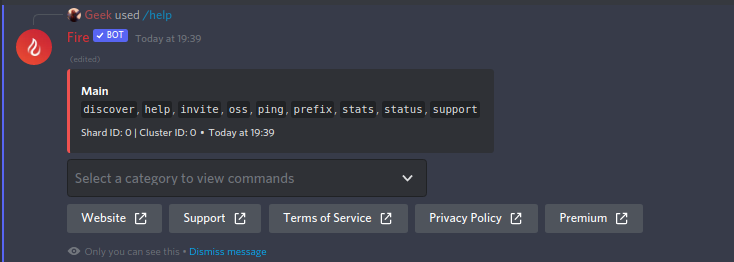

Selecting a category will edit the message rather than sending a new one and it won't timeout so you can use the same embed and select a category weeks later and it'll show you the latest commands in that category.

### Slash Command Upsells

You may see have seen some changes to Fire with regards to slash commands. These changes have a few prerequisites so you won't see it in all servers so if you don't see a difference, that's why.

***

* If you're still using message commands (and the server meets these prerequisites), you have a chance to be prompted with a message letting you know about Fire's switch to slash commands. This message will change depending on whether or not you have Fire's slash commands added to the server or not and if not, whether you can add them.
* The new and improved help command (which is available for everyone) will also change if you're still using message commands (and the server meets the prerequisites), any command that is only available via slash commands will be crossed out in the help command with a note telling you to switch, alongside the same message from above.
* The final change is with moderation commands, specifically the mod actions like warn, kick, ban etc. In some servers (mainly larger communities) you will see a warning attached to the responses of these commands letting you know that they will eventually be available via slash commands only.

***

All three changes will be enabled in more servers as time goes on to ensure everyone using Fire is aware of the switch. These changes are on Fire Beta too alongside the better slash commands.

I hope to have those changes merged sometime between the middle of and end of November, allowing time for these "upsells" to reach most users. allowing them to be ready for the change.

## Monday, September 27

### Better slash commands


These changes are currently only available on Fire Beta! You will need to invite the separate beta bot to experience them, https://inv.wtf/betabot


Fire no longer relies on creating fake content to parse commands from slash commands!

Before it would take the arguments from the slash command and create the content that a user would've written as if it was a message command and parsed it from that.

This, alongside creating fake Message & Channel classes, is what allowed me to get slash commands working in Fire a couple hours after their release but since I am migrating to slash commands only, I thought I'd improve it a bit.

**What does this mean for you?**

* Quicker response times (you probably won't notice this though, it's only a minor improvement)
* Better error handling with ephemeral errors
* Allowing users to run slash commands in modonly/adminonly channels by forcing them to be ephemeral

This involved a large rewrite of command handling so there may be issues with it. If you encounter any, let me know in [#fire-help](https://inv.wtf/fire) and feel free to ping me.

I've also updated the warn command to be slash only on Fire Beta just like I did with mute & unmute. The rest of the moderation commands will come soon.

## Tuesday, September 21

### WIP Moderation (Slash) Commands Overhaul

I have started working on making moderation slash commands better (since currently they suck) and have started with mute & unmute. These changes are on a separate branch (`feature/moderation-slash-commands`) and this branch will be auto deployed to [Fire Beta](https://inv.wtf/betabot)

If you have any feedback, feel free to leave it in [#fire-help](https://inv.wtf/fire)

This won't be merged into master when complete, only when I am ready to flip the switch on making moderation commands slash commands only (the way mute/unmute are in Fire Beta now)

## Autocomplete

Got some more juicy slash command updates for y'all 👀

Following the Discord Developers Q\&A earlier, I have implemented one of the features shown into Fire ([Fire Beta](https://inv.wtf/betabot) only for now), autocomplete!

That's right, some commands will now automagically provide you with choices to choose from for running the command. One example being returning commands in the `help`, `command` & `debug` commands (currently shows ALL commands, will eventually be filtered to ones you can use/manage) or returning tags in the tag commands!

To use this amazing new feature, you must be on the latest version of the Discord app

If you encounter any issues with these, let me know in [#fire-help](https://inv.wtf/fire) and feel free to ping me for them.

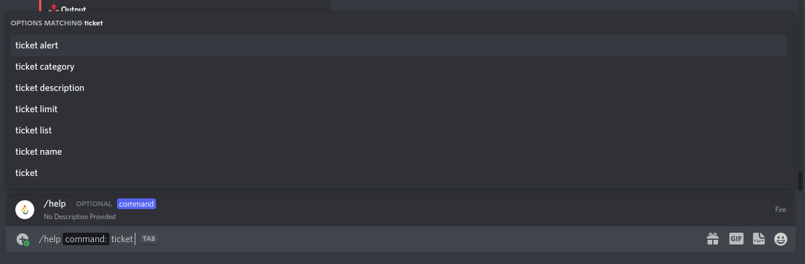 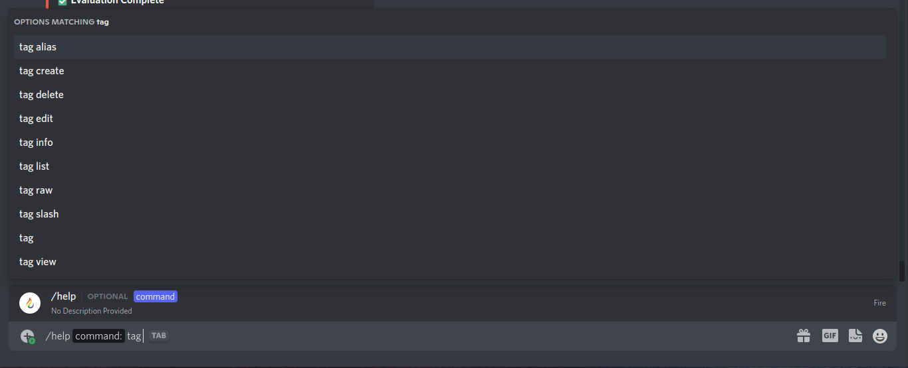 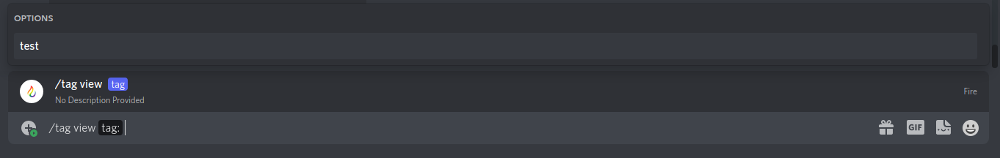

## Monday, August 23 / Tuesday, August 24

Today I am pushing a lot of changes to [Fire Beta](https://inv.wtf/betabot) that will soon be deployed to production. This changelog is going out early to allow users to provide feedback on these changes as they are quite major and I will not be surprised if there are users with negative opinions on the changes.

**Edit - 20:12 UTC, August 24th - These changes have since been deployed to the main bot.**

If you have feedback you want to give, you can join the [Fire Discord](https://inv.wtf/fire) and leave it in the #fire-help channel or email it to [feedback@gaminggeek.dev](mailto:feedback@gaminggeek.dev) if you want to provide feedback privately

### Miscellaneous Stuff

I have re-enabled the Discord experiment fetching in Aether and subsequently "fixed" showing guild experiments (this will also fix Advaith's [Experiment Rollout site](https://rollouts.advaith.io))

I have also fixed a potential bypass for invite filtering.

### Steal Command

The steal command was disabled on August 17th following advice I had received from a Discord employee which you can see below or [click here](https://canary.discord.com/channels/613425648685547541/696891424041598978/877251437388771388) to view the messages in [Discord Developers](https://discord.gg/discord-developers)

.png>)

.png>)

After a bit of consideration, I have decided to rename the command rather than remove it due to how useful it can be f.ex for mobile users wanting to upload emojis

The command has been renamed from `steal` to `emoji` and now takes either an existing emoji, emoji URL, attachment URL or attached image when running the command.

Due to these changes, I had to swap the order of the arguments. The emoji name comes first and then the emoji/URL. I have tried my best to make it smart enough to figure out if you reversed them but it's not guaranteed to work. Please put the emoji name first and \*then\* the emoji.

### Updated Invite Command

The invite command no longer links to [https://inv.wtf/bot](https://inv.wtf/bot) but now has a button you can click to go directly to the invite.

This change was made to allow for using In-App OAuth which (last time I checked) is available to 50% of users on desktop

### Disabled Prefix Slash Command

It just didn't make sense to have something that only works for message commands, as a slash command...

### Removed Autoquote Command

The `autoquote` command was used to toggle automatic quoting when a message link was found in a message.

This has now been replaced with a check for whether the `quote` command is disabled. Disabling the quote command will now disable auto quoting.

### Removed Message Collectors

A few commands (such as `close` and `delremind`) have been updated to **only use buttons** rather than waiting for a message. You can no longer type `close` to close a ticket or `yes` to delete a reminder.

### Added New Tag Subcommands

`/tag list` & `/tag view <tag>` have been added to replicate functionality of the base tag command with slash commands as you cannot use `/tag` like you can use `$tag`

### Forcing Slash Commands

This is the more controversial part of this update...

32 commands in Fire (approximately 29% of all commands) are no longer usable via messages. Attempting to use these commands will prompt you to use slash commands instead.

This change was made to encourage the use of slash commands amidst the [upcoming message intent changes](https://support-dev.discord.com/hc/en-us/articles/4404772028055-Message-Content-Access-Deprecation-for-Verified-Bots) in April 2022. Fire will eventually be usable via slash commands only and this is the first step towards that.

The decision to go slash commands only was already made before the whole message intent announcement but was pushed forward because of it.

I understand that some of you may not like slash commands in their current state and I assure you there are improvements coming!

## Tuesday, August 10

### Context Menus

Today Discord has released `Context Menu Commands` that allow bots to add actions to right-click menus on both users and messages (more will come) and Fire has full (hacky, but full) support for them!

Once you're on the latest version of the Discord desktop app (no mobile support for now), you should be able to right click users to see a `User` option in the `Apps` menu which you can use to get information about the user you right clicked (it's the same as doing `/user @TheUserYouClicked`)

You can also right click messages and see two options, `Google It` and `Remind Me` with will run `/google <the message content>` and `/remind <the message content>` respectively, with a twist!

The `Remind Me` option will give you a dropdown with predefined times for setting a reminder rather than you entering a time since this is all I can really do without a text input component.

## Friday, July 9

### Filter Exclude Command Disabled

The `$filterexcl` command has been temporary disabled until I can get around to rewriting it as it seeming has many issues that were recently made apparent to me through its usage of incorrect strings. I have no clue when I will be able to rewrite it and re-enable it so I can't tell you when it will be back

All existing filter exclusions are still in effect. if anyone **needs** it to be changed, please join the [Fire Discord](https://inv.wtf/fire) and let me know in the #fire-help channel as I can manually edit it.

## Tuesday, July 6

### i18n Rewrite

Fire is now using the i18n rewrite which means soon you should get more languages to choose from in the bot. I'd like to give a big thank you to everyone who has already contributed translations on Fire's Crowdin page ([https://inv.wtf/i18n](https://inv.wtf/i18n)) and at the weekend I will be approving translations and adding them to the bot alongside giving flags and roles\*

One small downside of the i18n rewrite being deployed now is that I had to remove the owo "language" for now as I haven't had a chance to rework that yet. Any user/server that had been using owo will see it once it's readded, your configs haven't been changed.

\*Unfortunately I cannot give the 50% for Fire Premium yet as I can only do that once the new website has been launched

### Discord.JS Fork

Fire is also using my own fork of Discord.JS which re-adds structures to prevent me having to basically rewrite Fire. This is not a permanent solution but it will do for now. I'm still trying to decide how I will approach rewriting Fire, whether it'll just be working around the lack of structures, using a different library or another full rewrite of Fire in a different language.

### Snoozing Reminders

You can now snooze reminders! Too busy to handle a reminder the second you get it? Just click the blurple snooze button, pick a time from the dropdown and voilà, you will now be reminded at a later date!\
You can check out a demo video [here](https://youtu.be/Yu4fES-hHVQ)

## Thursday, July 1

### Fire is now on Crowdin

You can now help translate Fire into new languages by heading to [https://crowdin.com/project/fire-discord-bot](https://crowdin.com/project/fire-discord-bot) (shortlink: [https://inv.wtf/i18n](https://inv.wtf/i18n))

This will help Fire be introduced to a wider range of communities. I've gone ahead and added \~30 languages to the list to be translated but if a language you want to translate isn't there, feel free to @ me and I'll get it added, same goes for if you have any questions e.g. how/where a certain string is used.

To reward translators, anyone who contributes a decent amount of translations will get 50% off Fire Premium for a year and the flag for the language(s) you translated will appear next to your badges in the user command (and maybe a role here with a secret channel but I'm still unsure on whether I want to add to the already long list of roles lol)

The code changes required to support the new i18n system haven't been merged yet so if one of y'all speedruns translating a language, it might be a week or two before it can be added to Fire so be patient

One last thing, some strings will be ones you can take from Discord (e.g. permissions) so whenever possible please use any available Discord translations.

## Monday, June 28

### Threads Support

With the limited release of threads for bot developers (a.k.a anyone with <=5 members in a server, one of which must be a bot), I thought I should mention that Fire fully supports threads! Anyone taking advantage of the early access will see new logging events for threads and full support for quotes in/from\*\* threads.

Thread Log Events\*:

* Thread Create
* Thread Delete
* Thread Members Update
* Thread Update

#### Notes on commands inside threads

Running a message command in a thread Fire can see but is not a member off will cause Fire to try join the thread. If the thread is (somehow) archived or Fire is missing permissions (manage threads for private, view channels for public/announcement), it will not be able to join the thread and the command will not run. You will not receive any feedback if this happens.

**It is recommended to use slash commands in threads.**

#### Notes on ticket threads

(No idea what ticket threads are? Check out [this video](https://youtu.be/8JnrotShzA4) I made showing them)

As some of you may have heard, private threads have been locked behind a paywall (Boost Level 2 a.k.a $75/month) which has put that feature on pause for now. If this does not get reverted, one of two things will happen;

* The code for it just gets deleted
* It is available for select guilds, similar to the Minecraft logs feature

I really wanted to have this feature available for everyone on release but if it stays behind a paywall then I am unsure whether I want a public feature in Fire that requires boosts. Currently less than 50 of Fire's servers (roughly equivalent to 4% of the total servers it is in) have enough boosts to use private threads.

\* Fire may need the Manage Threads permission to correctly log events from private threads, otherwise it may log creates/deletes as it is added/removed from a private thread\
\*\* Quoting from a thread will require you to be in the thread, even if it is a public/announcement thread.

## Wednesday, May 26

### Buttons

Buttons are finally here!

Discord has just released the next addition to its interactions API, buttons! These allow bots to do a bunch of cool new things and in true Fire fashion, it already has support! (It's technically had support for weeks now lol)

You should start to see buttons replacing reactions in Fire, for example with any paginators. There's also buttons hanging around in a few commands to provide quick access to helpful features.

The best way to try out these brand spanking new clicky bois is with the `$tictactoe` command. Find a friend and have fun playing against them in this classic game.

**If you can't see buttons, make sure you update your client!**

.png>)

## Wednesday, March 31

### Per Channel Voice Regions

Discord seems to have fully rolled out per channel voice regions, and Fire now has support for them! It will now log changes to channel regions and display all regions in the `$guild` command. It supports both normal voice channels and stage channels. Support for stage channels should also be available for [voice channel roles](hc/premium.md#voice-channel-roles).

## Friday, March 26 2021

### Starboard

Ever want to pin a message but you've hit Discord's limit of 50 pins in a channel? A good alternative to pins is a starboard, which you can now make with Fire!

With Fire you can setup a starboard channel, set the amount of stars required to be added to the starboard and premium users can even use a custom emoji!\* Learn more about premium [here](hc/premium.md).

Just run `$starboard` or `/starboard` to get **star**ted (get it? star-ted because star-board haha I'm hilarious)

\*I am open to making custom starboard emojis available for non-premium users a little while after the release depending on some statistics and if it is requested enough.

## Thursday, March 25 2021

### Slash Commands Release

Slash commands are finally out of beta! You should now see Fire's slash commands in all servers with the bot and new ones invited using [https://inv.wtf/bot](https://inv.wtf/bot)!

Almost all of Fire's commands are available for use with slash commands and should function the exact same as message commands (aside from some reaction workarounds)

Go ahead and hit / and start using the awesome slash commands Fire has to offer :D

## Saturday, March 20 2021

### Fire Beta Is Back Online

Fire Beta is back online! 🎉

Unlike what I originally planned, it is running on the same VPS as the normal bot but has a separate database for everything and is starting from a completely clean slate.

It's prefix is `beta` and has the same slash commands as the main bot. This bot will be used to test new & potentially breaking features in a production-like environment so **do not expect the bot to be stable** (but what you _can_ expect is pretty similar uptime to normal Fire as I'll be using Fire#7414 solely for local testing from now on and Fire Beta will stay running on the VPS)

If you would like to invite Fire Beta, you can now use [https://inv.wtf/betabot](https://inv.wtf/betabot) to invite it.

Any issues with Fire Beta should not go to #fire-help but rather [https://inv.wtf/betabugreport](https://inv.wtf/betabugreport)

## Tuesday, March 16 2021

### Permission Roles

Permission roles allow you to set permissions for a role in a channel, run a command (in the channel with the permissions) and have them copied to all other channels, including new ones!

This is useful for roles such as a "No External Emojis" role that denies `Use External Emoji` for those pesky users using NSFW emotes or a "Bad Memer" role that denies `Attach Files` and `Embed Links` for those who can't help but use their image perms to be disruptive.

Currently permission roles are limited to 1 permission role for non-premium servers and unlimited for premium servers, which you can learn more about [here](hc/premium.md)

### Behind The Scenes Changes

Over the past little while I've been making a bunch of behind the scenes changes to improve existing features, reliability of the bot itself and working on the website rewrite (alongside amazing web devs, [Bruno](https://bruno.codes) and [Nystrex](https://nystrex.com) who have done pretty much all of the frontend work) which will include migration from Patreon to Stripe for Fire Premium.

There's still a lot more behind the scenes changes coming which will make Fire even better than it already is (yes, it is indeed possible to make the best bot better 😂)

## Monday, March 8 2021

### Slash Command Tags

Yup, that's right, I have made Fire replace [advaith's Slashtags bot](https://discordextremelist.xyz/en-US/bots/slashtags)!

I have enabled an experiment in a small number of guilds that gives access to the `tag slash` command, allowing you to toggle slash command tags for that guild (and by providing a boolean, e.g.`$tag slash true` you can change whether or not the tags will be ephemeral)

.png>)

If your guild doesn't have access to slash command tags, don't fret, it will eventually be available to all guilds. I am doing a slow rollout because there's strict ratelimits on slash command stuff so I want to make sure hundreds of guilds aren't toggling slash command tags in a short period of time.

If you'd like access, join the [Fire Discord](https://inv.wtf/fire) and let me know why you think your guild should have it in the #fire-help channel :)

## Sunday, March 7 2021

### Add Lock To Ticket Creation

Sometimes when creating a ticket, if a user managed to run the command multiple times in quick succession, they could open more tickets than the server's limit (especially if said limit is 1), causing one or more of those channels to not be considered tickets, meaning `$close` would not work.

Creating tickets now uses a semaphore to ensure it is only being ran \*insert server ticket limit\* times or less at once, meaning these issues should cease to exist!

## Wednesday, March 3 2021

### Multiple Prefixes

You can now have multiple prefixes! That's it, that's the changelog :D

## Tuesday, February 23 2021

### Icon Command

"Ok, hear me out. Imagine the avatar command, but instead of showing a users avatar, it shows the guild's icon" thus the icon command was born! Wow, isn't that a great story?

.png>)

## Friday, February 12 2021

### Temp Bans

You can now temporarily ban a user from your server. It's basically the mute command now except banning instead of muting (especially since the temp ban code is copied from mute lol)

e.g. `$ban advaith#9121 too much blob 1 day`

### Fixed Incorrect Global Ban Info

Sometimes the user command would say someone is banned on KSoft.Si when they're not. It no longer does this. Epic.

### Public Guild Info

The guild command can now display info for public guilds, such as discoverable guilds or ones that have made their guild public with the `$public` command.

### Basic Message Filters

With the `$anti` command, you can now enable some **basic** message filters such as deleting messages with @everyone or @here if the user doesn't have permission to use them, messages from selfbots (users sending an embed) or "spoiler abuse"

## Wednesday, February 10 2021

### Ticket Alert Role

You can now set a role that will be "alerted" (pinged) when a new ticket is opened, allowing you to f.ex. notify the staff team of a new ticket so they can have super fast response times.

You can set this the same way you set the rest of the ticket config options, `$ticket alert <role>`

### Close Pointless Tickets

Another ticket related addition, any ticket where the author leaves after not saying anything at all in the ticket will now be closed automatically so people who open a ticket for no reason then leave won't waste your time.

### Ignore Bots

Bots will now be ignored for join/leave messages (logs are unaffected) as they do not deserve to be welcomed smh

### Ignore Channels From Logging

You can now ignore channels from logging with the `$logignore` command so message edits/deletes, purges, link filter triggers etc. will not be logged from the channels you specify.

No more accidental leaks from your secret channel where you post only the spiciest of memes when you accidentally edited that one message

### Bam

I'll let you figure this one out yourself. Long awaited suggestion from Noctember#6660 ;)

### New Log Types

Previously locked to guilds with an experiment, I've just flipped the non-existent switch that enables both role update & nickname update logging for all guilds with member logs enabled.

This may cause issues so if needed, the non-existent switch may be flipped again to disable them to prevent further issues.

### Logging Changes For Large Guilds

Guilds with over 1,000 are no longer able to set multiple log types in the same channel. This is to prevent logs getting clogged up in large guilds due to the amount of logs being sent as Fire can only send 5 messages before it needs to wait a bit until it can send again.

Attempting to set multiple log types in a single channel will return an error and existing large guilds with multiple log types in one channel will have those log types automatically disabled and a message sent in the log channel to explain why.

## Tuesday, February 9 2021

### DM Slash Commands

Discord has recently released the ability to use slash commands in a bot's DMs and Fire now fully supports them. I _tried_ to prepare for this when it was announced but it still broke when it was released.

If you spot any bugs with slash commands in DMs, feel free to open an issue on Fire's GitHub repo, [https://inv.wtf/github](https://inv.wtf/github)

### Per-Server Blacklist

You can now "plonk" users from the bot in your guild! Just run `$plonk @User#1337` to prevent a user from running Fire commands. Run `$unplonk @User#1337` to allow them to use commands again.

### Reaction Roles

Only took over a year but I have finally rewritten Fire's reaction roles and it is better than ever!\
You can check out the demo video I recorded during development [here](https://static.inv.wtf/reactrolesdemo.mp4) which basically showcases the feature as a whole in a short 30 second clip.

This feature is **premium only**! You can learn more about premium [here](hc/premium.md).

## Thursday, February 4 2021

### Carbon Command

That's right, you can now use your favorite bot to generate beautiful images of your code using [carbon.now.sh](https://carbon.now.sh)!

This feature was inspired by [Ravy](https://ravy.pink)'s bot [Aero](https://aero.bot) but is better because it has transparency and the ability to switch theme & font with flags

e.g. `$carbon console.log("Hello, World") --theme nord --font firacode`

Due to limitations with Akairo, the command framework Fire uses, you can't have spaces in the flag values (but it fuzzy matches so it's fine)

## Tuesday, February 2 2021

### Ticket Descriptions

You can now set ticket descriptions! These will be shown in the embed sent in new ticket channels, allowing you to give a message to a user (e.g. telling them what info they should provide)

Use `$ticket description <description>` to set the description or `$ticket description` to reset it

### Embed Command

You can now use Fire to send embeds since users cannot. This command works by taking an embed object from a haste service ([hastebin.com](https://hastebin.com), [hasteb.in](https://hasteb.in) or [hst.sh](https://hst.sh)) and send it to the current channel or any other channel!

e.g. `$embed https://hst.sh/kaxesebivo.json #testing`

You must have **Embed Links** permission to run the command and **Manage Messages** in a channel to send to it from a different channel.

## Wednesday, January 27 2021

### Colo(u)r Command

That's right, it only took a year since it was suggested but Fire now has a color command!\
Don't worry, if your language is set to en-GB it will say colour.

Simply run `$color [<color>]` to quickly convert colors to different types (hex, rgb, hsl or hsv) and get a preview of that color!\
If you don't provide a color, a random one will be chosen.

## Tuesday, January 19 2021

### Fire Has Turned Blue!

Okay, not literally, but Fire has been fully rewritten in TypeScript (the TypeScript logo is blue haha get it)

This is a MAJOR change for Fire as every aspect has been rewritten and improved. I unfortunately can't go over every single change or improvement but I'll list a few highlights below

#### Replies Support

Fire will now use replies when sending error message, the ping command and also when using tags (if you reply to a message with a tag, Fire will reply to that message with the tag content, mentioning the user. Works best with the `dtag` alias)

#### Better Tags

You can now edit tags and give them aliases! This is long overdue 😂

#### Better "Decancering"

With autodecancer enabled, Fire will now attempt to normalise a users name if it is "cancerous" (man I hate this terminology) which means no more `John Doe 1337` for `𝖙𝖍𝖚𝖌 𝖑𝖎𝖋𝖊#1337` over there, instead they will be nicknamed `thug life`

Members will also be checked for hoisted/cancerous names on message and member update meaning less hoisted/cancerous users.

#### Slash Commands

Discord's long promised slash commands have finally released and Fire Beta supported them within 48 hours of release for 50 commands (which is sadly the limit) and since the rewrite has been deployed, normal Fire supports them too!

You will need to grant Fire the `applications.commands` scope to access slash commands, which you can do by heading to [inv.wtf/bot](https://inv.wtf/bot) and reinviting Fire with the scope.

#### Autorole For All

Autorole is no longer a premium feature and is available to all servers with Fire! I've also added a bit of spice to the command in the rewrite, allowing you to set a bot autorole as well as normal autorole.

This also supports Discord's membership screening feature meaning users will not get the role before passing screening.

#### Moderation Overhaul

Moderation has been overhauled in the rewrite due to the flexibility of discord.js allowing me to have custom guild, member & user classes. This allows for cleaner code and easily allows me to add more moderation features.

Moderator IDs are now stored so you can see who gave Billy that warning for posting a meme in general. Speaking of warnings, they will also display warning count in the success message,\
e.g. **Geek#8405** was warned for the 69th time

#### Member Join/Leave Logging Has Been Moved

Member join/leave logging is no longer included in moderation logs. You can set a dedicated channel for member related logging with `$log member #channel`

#### Improved Reminders

Reminders have been improved with better time parsing and the ability to repeat reminders with a "step".

It should no longer say you set a reminder for "59 minutes, 59.294 seconds from now" when you set a reminder for an hour and the same has been done for DMs (although DMs are a bit more finicky)

Repeating reminders with a step allows you to make multiple reminders with additional reminders on an interval.

.png>)

#### Improved Google Command

Lots of improvements, including the `google` command!

These improvements include

* Re-use browser & context
* Moving Playwright code to Aether, allowing clusters to share the same browser & context instances
* Add zlib compression to the Aether websocket, since the HTML data that Fire sends to Aether from the Google Assistant API is massive

#### Scalability

Fire is now much more scalable through the magic of [Aether](https://git.farfrom.earth/aero/aether)! Aether was originally designed by [Ravy](https://ravy.pink) to handle [Aero](https://aero.bot)'s shards but I've gone ahead and made my own fork of it, rewritten it in TypeScript, added a Rest API, statistics tracking with Grafana & Influx, realtime statistics for the [Fire website](https://getfire.bot/stats), Playwright (as mentioned above), reminders and more.

Aether allows Fire to have multiple independent instances that link together through it via a websocket, allowing me to quickly scale Fire up if needs be. This allows each cluster to communicate with Aether and each other, powering features such as the Google command, reminders, user settings, premium, command, module, listener & inhibitor syncing and more.

### System Metrics

Fire's [status page](https://inv.wtf/status) now shows system metrics! These include both average rest & gateway latency across all clusters.

### Miscellaneous Website Changes

Fire's website has gotten a few updates to accommodate changes in the rewrite, such as cluster support on the stats page, realtime stats updates, and better routing meaning the page no longer refreshes when navigating to a different page and now has a seamless transition.

## Wednesday, December 2 2020

### Major Caching Changes

Somewhat major update, concerning those who use logging, autodecancer & autodehoist,

I have deployed an update that affects how members are cached, causing other features to be affected too, some in a positive way and others negatively.

Due to these changes, I have had to remove role update logging & nickname update logging. These relied on members being cached due to Discord not providing the previous state. They may return in the rewrite but it is unclear at the moment.

A positive side affect to this change is that I've made autodecancer/autodehoist function similarly to the rewrite where members don't need to be cached for them to be decancered/dehoisted. It will also attempt to run the checks on each message too.

If you encounter issues related to autodecancer or autodehoist, please let me know. I have done some testing but my one-user test may not account for all scenarios.

## Tuesday, November 10 2020

### Vanity URL Changes

Rather than using JavaScript/meta tags to power redirects for Vanity URLs, it will now return status code 302 in most cases (which should also make them faster as there's no body to load)

The only time the old HTML response will be returned is if a request is coming from Discord/Twitter/Slack so they can embed the link with the custom embed. If there's a site that embeds links using OGP tags that isn't one of the 3 listed and you would like inv.wtf URLs to embed there, let me know what the site is in the [Fire Discord](https://inv.wtf/fire) (and if you know the user agent they use to send requests that'll help get it changed quickly)

Sites that aren't one of the 3 listed above will still show an embed if they follow redirects but it'll be Discord's own embed. If you encounter any issues with inv.wtf please let me know in the [Fire Discord](https://inv.wtf/fire) too as I also changed a bit of error handling because the old error handling code looked like I was drunk while writing it o\_O

## Friday, September 25 2020

### Changes To Case IDs

Moderation Case IDs are no longer numbers and now use [https://github.com/puyuan/py-nanoid](https://github.com/puyuan/py-nanoid) since the numbers have started showing letters and symbols (oops)

## Wednesday, July 1 2020

### Website Updates

There's now a search bar on Fire's commands page :D

No more endlessly clicking through categories to find what you want, just type a command name and you'll be greeted with matching commands, their description, usage and aliases.

## Tuesday, June 16 2020

### Small Bug Fix

If you've encountered an issue with Vanity URLs stating an error similar to `'bool' object has no attribute 'copy'` it has now been fixed, sorry for any inconvenience

## Monday, June 15 2020

### Extra Debug Info For $mute

The debug command can now show extra information for the `$mute` command. You can see an example below. Any users/roles listed for bypassing mutes means they have been explicitly granted `Send Messages` in the current channel.

Due to how Discord's permissions work, even if many roles have a permission denied, as long as one role has it allowed then they will always have that permission, meaning allowing a role Send Messages will cause that role to bypass mutes.

.png>)

## Sunday, June 14 2020

### Edits With Paginators

When editing a command message where both the old and new commands used paginators, Fire will now forget the old paginator instead of switching between the two upon reacting.

### Guild Command Redesign

The `$info guild` command has gotten a redesign! It now looks nicer and has many more aliases (`guild, infoguild, info guild, guildinfo, infoserver, serverinfo`)

## Tuesday, May 19 2020

### Delete Flag For Ban

You can now choose how many days worth of messages to delete when banning a user with the `--delete` flag (`-d` works too)\
Example: `$ban Aktimoose using deprecated regions --delete 1` to delete messages from the past day (max is 7 due to discord limits)

If the flag is omitted then no messages will be deleted.

## Sunday, May 17 2020

### New Link Filter

`shorteners`, enable with `$linkfilter shorteners`, deletes common short links, e.g. bit.ly

### Changes to moderation commands

Moderation commands no longer respond if `--silent` is used

## Wednesday, May 13 2020

### New Commands

`$tips` - Toggle a 10% chance of seeing a useful tip when running a command (enabled by default, see screenshot for an example)

.png>)

## Tuesday, May 12 2020

### New Commands

`$badname` - Change the name used for auto dehoist/decancer. This will **not** change existing nicknames! `$autodecancer` - Toggle renaming those with "cancerous" (non-ascii) names. This will **not** rename existing users!\
`$autodehoist` - Toggle renaming those with hoisted names. This will **not** rename existing users!

### Changes you probably won't notice

Fire _should_ no longer log role removals for deleted roles. It may still log a few before the role is actually deleted but this should prevent logs being spammed in large guilds from removing a role that everyone has

## Monday, May 11 2020

### New Commands

`$reminders`- You can now see your reminders. This really should've been a thing from the start `$delremind` - You can now delete your reminders. This really should've been a thing from the start (see screenshot for more info on how to delete a reminder)

### Changes you probably won't notice

The mute command will now delete mutes before attempting to removing the role, meaning tons of mutes don't build up in my database and people don't get muted if/when they rejoin (don't you just love people who leave after getting muted) even though their mute expired

.png>)

## Sunday, May 10 2020

### Changed Commands

The `$info user` command has gotten a redesign! It now looks nicer and has many more aliases (`user, infouser, info user, userinfo, whois, u`)

### New Commands

`$antispam <chance of spam>`

Toggles ChatWatch spam prevention. If messages have a chance of spam greater than or equal to the chance provided in this command, they will be deleted.

**THIS HAS BEEN ENABLED BY DEFAULT WITH AN 80% CHANCE OF SPAM FOR GUILDS WITH AT LEAST 1000 MEMBERS!**

## Saturday, May 9 2020

### New Commands

`$slowmode <delay> [<channel/category>]` - Set slowmode in the current channel, another channel or a category\
`$ghstatus` - Check GitHub's status\
`$cfstatus` - Check Cloudflare's status

### Removed Commands

`$hyperium`, `$fetchchannel`, `$fetchactivity`

### General Updates

Fire will now automatically set it's status on [https://status.gaminggeek.dev/](https://status.gaminggeek.dev) depending on it's ping.

## Friday, April 3 2020

### New Debug Command

If you do `$debug <command>` Fire will go through some common things that may prevent a command from running (global checks, permissions, whether the command is enabled or not) and give a list of issues if any are found. This should help with figuring out small issues so if some command stops working, use the debug command and if the debug command stops working, seek immediate help [here](https://inv.wtf/fire)

## Thursday, April 2 2020

### Changes to public servers

To ensure that people cannot scrape the invites from the page, you will now have to solve a captcha to get redirected to the invite. This is to prevent abuse of the page and to ensure your server is protected from potential spam bots joining.

## Wednesday, April 1 2020 (I promise it's not a prank)

### **Changes to Vanity URLs for better consistency**

For the past few months, Vanity URLs have been accessible through many domains, with the 2 main ones being `oh-my-god.wtf` and `inv.wtf`. The latter however was only available to premium guilds and also had support for custom redirects. Starting from today, **inv.wtf is the only main domain for Vanity URLs and will eventually be the only domain they're accessible from**

This change means that even non-premium guilds will be able to use this domain for their Vanity URLs (redirects are still premium) and the other 5 domains will eventually be phased out and no longer function.

This is for better consistency with Vanity URLs, less hassle for other bots to be keeping up with what domains Fire vanity URLs are accessible from to filter them if they choose to do so and finally as a cost saving measure. I don't have a job and the only way for me to keep Fire up and running pretty much 24/7 is the wonderful people who have supported Fire by purchasing premium <3

I'd like to thank you all for using Fire and hope you enjoy these new updates :D

## Wednesday, March 18, 2020

### Bug fixes and changes to command handling

First we have bug fixes, my favorite. `--remind` now actually works which is nice and (not that it matters to any of you) my logs are no longer spammed with errors when starting Fire :D

Anyways, actual cool things now. Fire has been able to run commands when you edit your message for a long time now, but as of about an hour ago during the maintenance, Fire will now edit the response from the old command too! **This won't work for any commands that use files due to a Discord limitation**

If you have suggestions for Fire, feel free to use the `$suggest` command to let me know about 'em. I will start working on suggestions in the next few days as I've sorta been neglecting them

## Thursday, March 12, 2020

### Configurable muted role

You can now set the muted role Fire uses when muting users! Just use the command `$muterole [<role>]` to set it.

If you don't provide a role, Fire will reset it and just use a role called "Muted" and if it's not found, it will create one.

## Friday, March 6, 2020

### Removal of music

Important update for those who make use of Fire's music feature!

Due to many reasons (Lavalink being a piece of trash, YouTube blocking Fire's IP many times, Lavalink being a piece of trash), I ave removed Fire's music feature completely. This will free up a lot of resources on Fire's vps as Lavalink is quite resource intensive, with ram usage in excess of 1.5GB at times, which will allow for more expansion.

Fire was never made to be a music oriented bot and music was always a low priority. I have not changed anything related to music since January 10th as Fire's music has been considered "deprecated" since then.

If you used Fire's music feature, I'd recommend switching to Groovy ([https://groovy.bot/](https://groovy.bot)) for all your music needs (and keep Fire for it's other features of course). As Groovy is a bot specifically for music playback, you will have a better experience with it.

Thank you for using Fire and I apologize for any inconvenience caused by this removal.

## Wednesday, February 26, 2020

### Update to snipes

hi i did the same as quotes but for snipe and esnipe and you can only snipe a message once now. once it's sniped, it get's yoinked from fire's memory ok thanks bye

_such a professional update changelog thing_

## Sunday, February 23, 2020

### Quotes

oh hey a new fea- wait a minute, this isn't new!

That's right, I have rewritten an existing feature and made it cooler :D Fire's quote command (and auto quoting, `$quote auto` to enable) now has it's own file and a new addition.

If in a channel where Fire has `Manage Webhooks` permission, it will make use of this to make quotes cooler. It will show kinda like the user themselves repeated their message, except there's a **BOT** tag because it's a webhook. It will use an existing webhook or create one if none exist in that channel. **Tip:** If you want to go back to the old quotes, just remove `Manage Webhooks` from Fire (and `Administrator` if applicable) and it will be like nothing changed!

I hope you enjoy this new addition to quoting because I personally love it. If you encounter any issues, please let me know in [#help](https://inv.wtf/geek) or if you have a suggestion, use the `$suggest` command

## Friday, February 21, 2020

### Tickets

Today I am releasing Fire's newest feature, tickets! With this new feature, members of your Discord can create tickets for whatever reason they would need it. For tickets to be created, they must be enabled which can be done by setting a category using `$tickets category`. You can see all the configuration commands for tickets by using `$tickets`.

The main commands for tickets are;

`$new` - Opens a ticket\
`$add <user>` - Adds a user to the current ticket\
`$remove <user>` - Removes a user from the current ticket\
`$close` - Closes the current ticket

### Feature removal

Along with this new feature, we say goodbye to an old one. Fire's muted chat is now removed and Fire will no longer add users to it or set permissions for read messages to false in other channels. To reconfigure Fire's permissions for the Muted role, just delete it and mute someone to recreate it. This was a feature that quite a few people did not like and many did not even use so I made the decision to remove it. I don't see it ever coming back so if you liked it then I apologize for the inconvenience.

## Wednesday, February 19, 2020

### Command removal

The `tempmention` command has been removed. This is due to a recent Discord update that makes it kinda pointless. If you are unaware about the new update, anyone with `Mention Everyone` permission can now mention all roles without needing to change the mention toggle. If you don't see this, make sure to update your client.

## Wednesday, January 22, 2020

### Quoting changes

Fire will now find any image link in the message you are quoting, remove it from the message content and set it as the embed's image so that you don't need to click the link to see it

## Wednesday, January 15, 2020

### Rewrite merge

* Merged parts of the rewrite into [master](https://github.com/GamingGeek/Fire)


This isn't too big of an update for your average Joe, but in terms of the code base, the "core" is much cleaner an allows for more modularity with commands, events and core modules such as Chatwatch


## Saturday, January 11, 2020

### The reminders update

Fire now has reminders!

Fire can give you a reminder for anything and everything right in your DMs. There's two ways to set a reminder with Fire, a command or a flag.

With the command, you just do `$remind <your reminder here> <time>` e.g.`$remind fix logging in 1 hour`

The flag is an easy way to set a reminder by just adding `--remind` to your message. For example, I can do `I need to clean my room --remind 1 hour` and Fire will remind me to clean my room in an hour.

My favorite part of reminders is the support for message URLs. Place a message URL in your reminder and when it's time to be reminded, Fire will quote these messages along with your reminder.

Hope you all enjoy this feature as I had a lot of fun making it :)


Fire uses regex to find the time and replace it when giving you your reminder. It will attempt to catch phrases like `in 1 hour` or `that <reminder>` but sometimes it will do an oopsie and not get your time right. It's best to stick to using `1 day 2 hours 3 minutes 4 seconds` as the format.

