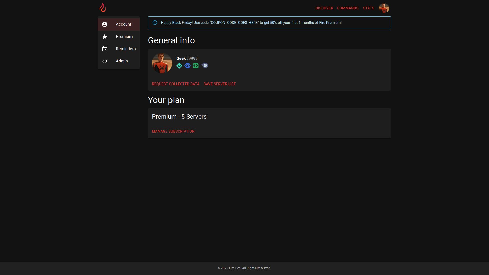
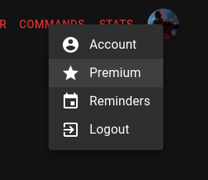
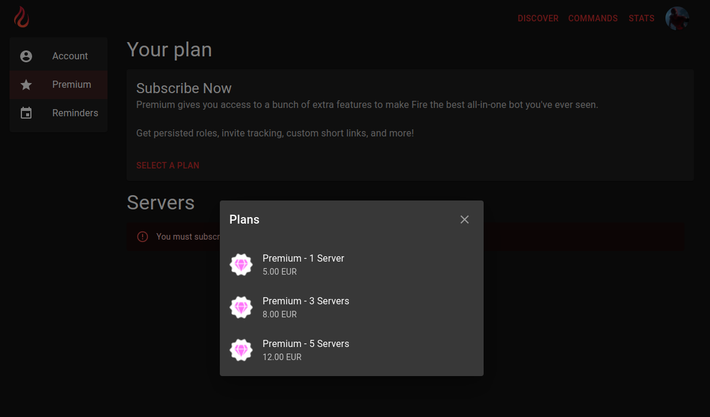
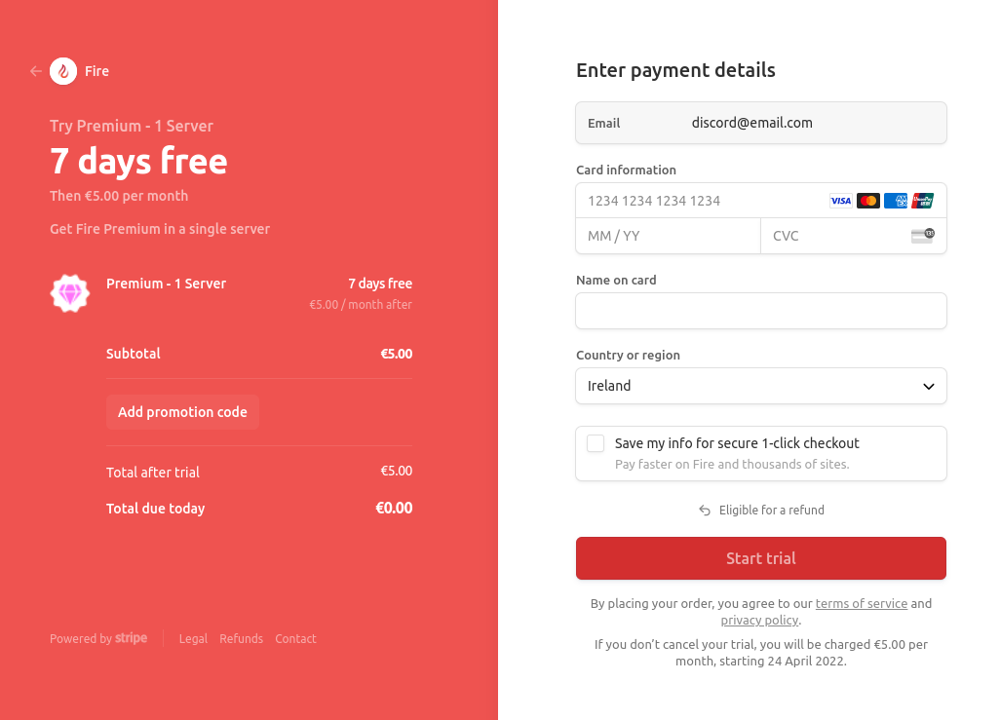

# 50% off your first 6 months of Fire Premium - FAQ

## Discount Details

**Q: How long do I have to claim the discount?**

A: The discount code is valid until Monday November 28th, 2022 at 11:59pm (UTC)

**Q: How long does the discount last?**

A: The discount lasts for the first 6 months of your subscription. After this period, you will be charged the full price of your selected plan unless you cancel your subscription beforehand. You can cancel your subscription at any time on the [premium page](https://getfire.bot/user/premium) but you will lose out on the remaining months of your discount, if any.

## Eligibility

**Q: Who can claim this discount?**

A: Anyone who has not previously subscribed to Fire Premium can claim the discount.

## Claiming the discount

**Q: Is there a coupon code?**

Yes, to avail of the discount you will need to use the limited time coupon code. This can be found at the top of the [account page](https://getfire.bot/user/account) while the promotion is active. It will appear as a banner at the top of the page if you don't have an active subscription.

**Q: How do I use the coupon code?**

To claim the discount, head to the [`Premium` page on the Fire Website](https://getfire.bot/user/premium)

From here, click "Select a Plan" and choose the plan you would like (1, 3 or 5 servers)

You will be brought to the Stripe checkout page from which you can enter the discount code found on the account page using the "Add promotion code" button.

