## Friday, November 21 2025

### Deprecation of self-assign role commands

With the ability to self-assign roles at any time now built into Discord via the `Channels & Roles` tab, these commands haven't had much reason to exist and while working on the new dashboard, it became apparent how old they are and how low-quality the code for them is, resulting in it being quite a pain to implement them.

Starting today, the `/addrank`, `/delrank` & `/reactionrole` commands have been removed. Existing ranks can still be applied via `/rank` and existing reaction roles will continue to function until January 1st 2026 when these features will be completely removed

This change gives Fire some more breathing room before it hits the 100 slash command limit. Other changes may be made to older commands to prioritise newer and more well-made features in the future, though this may be in the form of grouping similar commands together rather than removal

## Wednesday, November 12 2025

### Fire is having an identity crisis

Just kidding! But, if you wanted to, you can change Fire's identity now with Fire+ and the `/identity` command

By using `/identity update`, you can change Fire's nickname, bio, avatar & banner in your server to make it fit right in

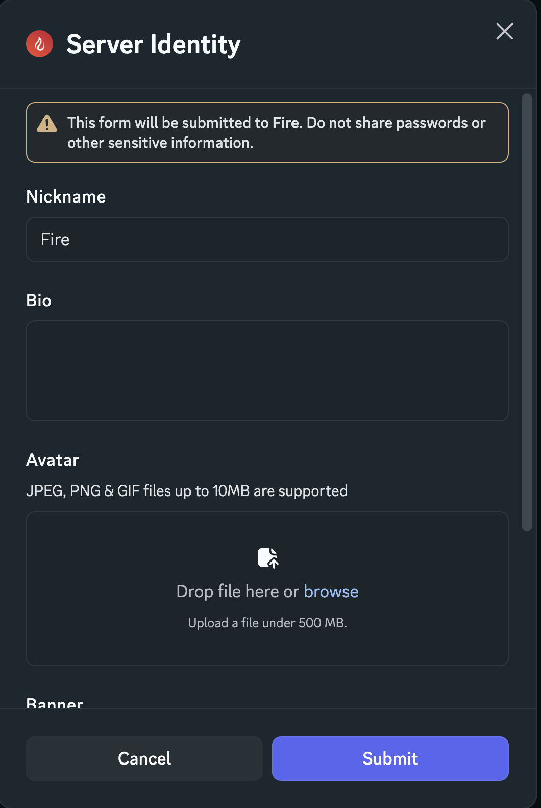

Changed your mind? Simply use the `/identity reset` command for the specific part of Fire's identity to put it back to normal (only for bio, avatar & banner as nickname can already be changed using Discord's own `Change Nickname` option)

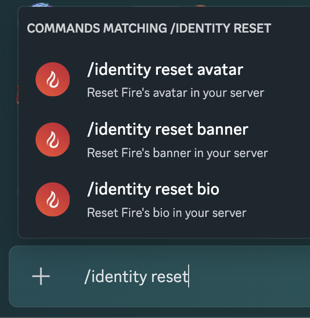

To celebrate the release of the first feature under the Fire+ branding, you can use the code `IDENTITY50` for 50% off your first 3 months of Fire+

Be quick, it's only available until this Sunday (November 16) at 23:59 UTC!
New customers only, free trial of 3 days available

## Wednesday, October 15 2025

### /starbord limit-channels

You can now limit the starboard to messages from a select group of channels via this new command as I have finally added support for the new types of dropdowns (user, role, mentionable & channel) that Discord added a long time ago 😅


<Callout type="warn">
Due to Discord limitations, you can only select up to 25 channels to limit starboard messages
</Callout>

### Components V2

It's been quite some time now since we were first introduced to buttons, dropdowns and modals... and it's also been some time since Discord added plenty of new components for bots to use, but Fire finally supports them, including the newly released file upload component for modals which was released today!

For now, components v2 usage is quite limited and only one existing feature has been modified as part of testing for the file upload component. The biggest change with this update is that quotes will now allow quoting of messages which contain these new components

Starting today, `/code-image` has been updated to accept either direct text input or a file for generating images of your code!


<Callout type="warn">
The file upload accepts your normal file size limit but Fire will only process files up to 2.5MB for this feature 
</Callout>

### A Look to the Future

Over the past few weeks, I have been working on some exciting new projects for Fire and I wish to share some small details about them here.

Currently, Fire is lacking something most, if not all, major bots provide: a dashboard. This is something that has been requested by users throughout Fire's lifetime and has not been something I've been able to offer in a capacity anywhere close to other bots due to my lack of web development skills

The current website is quite simple on the frontend but very much overengineered in the back with a websocket powering real-time communication for every aspect of the site when it is very much not needed.

With some help from Google's Gemini & Cloudflare's "Vibe SDK" platform, I have been working on a brand new website which has a more modern design and much more practical backend integration to power the features on it.

I do want to make it very clear that AI has not and will never be used to generate large portions of code for Fire or Aether (Fire's cluster manager) and is only used for the frontend development (firstly generating the main base via the Vibe SDK and then using Gemini as a tool to help). The use of AI for backend development is a surefire way to introduce security holes and should never be relied upon for important logic.

Here's a preview of the homepage, currently using Fire Beta's Aether instance to provide data, hence the smaller stats (there's also more to it when you scroll but it has placeholder data at the moment):


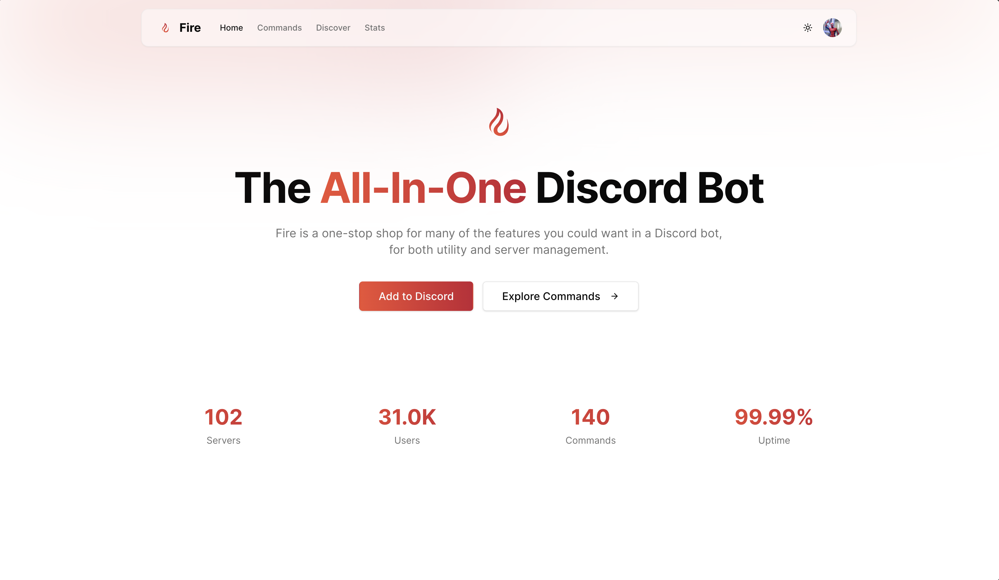

and a preview of the dashboard:

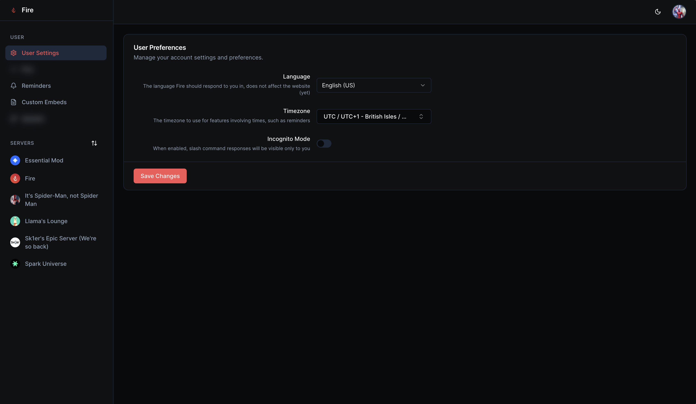


You may notice that some items of the navbar are blurred out and well, these aren't ready to be in the spotlight just yet but you'll see them once the new website is released, which won't happen until I have at least feature parity with the current one. There may or may not be a hidden hint about what one of them is in this changelog 👀

As it stands, data management (downloading your data package and server list), subscriptions & reminders are yet to be fully implemented and these are required for parity. I don't see these taking too long but I'd also like to have a bit extra available (e.g. embeds and one of the blurred items) to make it more than just a facelift

If you have any feedback or feature suggestions for the website/dashboard, let me know in the [Fire Discord](https://inv.wtf/fire)


## Wednesday, August 13 2025

### Moderation Logs Moderator Stats

Moderators can now view stats showing how many logs of each type given out, both for themselves and their fellow moderators. This can either be all-time stats or providing a time to view from (e.g. 30 days, 3 months, 1 year etc.)

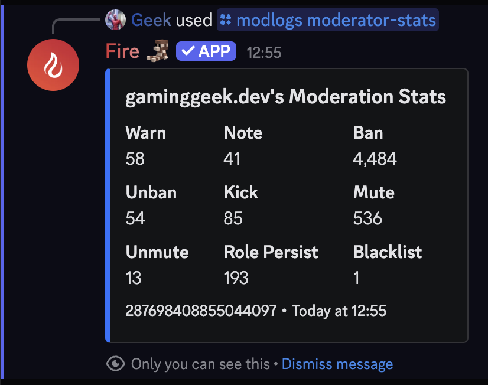
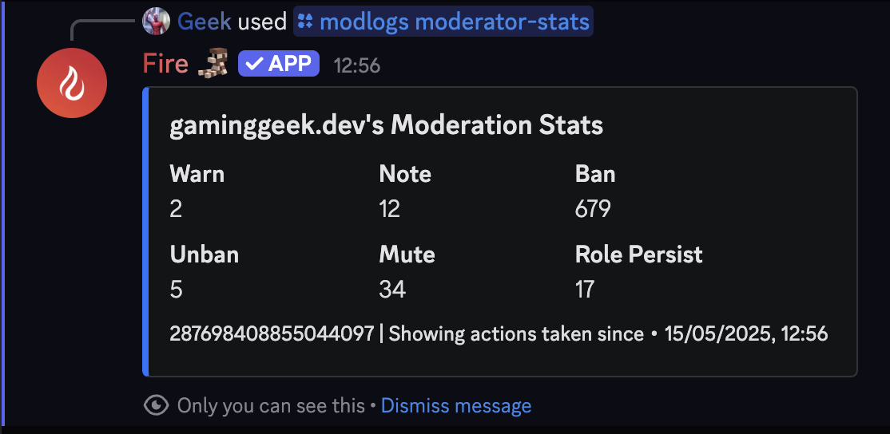

## Thursday, July 24 2025

### Showing other moderation actions previously taken against a user

Moderation commands like warn, kick, ban etc. will now show other actions (i.e. other than the action you're currently taking) that had been taken against the user in the past to make previous moderation history more visible which may help influence subsequent actions


## Saturday, May 10 2025

### Server tags in `/server` and `/user`

Discord recently started rolling out server tags (previously part of guilds, not to be confused with servers, which are called guilds in developer documentation)


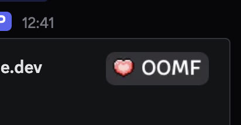

## Wednesday, May 7 2025

### Replacing `/carbon` with `/code-image`

The `/carbon` command, which allowed you to generate images of code using [carbon.now.sh](https://carbon.now.sh/), has been removed due to being quite buggy (such as sometimes showing ads in the image 🤮)

In its place, we now have `/code-image`, powered by [ray.so](https://ray.so/)!

This command allows you to do the same, generate images of code, with more control over the appearance of those images such as having plenty of themes, dark/light mode, padding options and the ability to set a "file name" that will appear in the image when using certain themes

It also now supports formatting code (for a select few languages, and it's advised to specify a language if you wish for it to work as auto-detect can be hit or miss) as well as retrieving code from online sources such as GitHub and supported paste services

Below is an example of an image generated with this command, formatted automatically and showing an early version of the code used to do so from during development


The original input for that image can be seen below

`/code-image theme:raindrop padding:16px language:typescript file-name:codeImagesRoute.ts`
```ts lineNumbers
const buttons = await page.$$("button"); for (const button of buttons) if ((await button.innerText()) == "Format Code") await button.click().then(() => { console.log("wow")});
```

### NeoForge support in Minecraft log scanning

NeoForge logs can now be properly parsed by Fire, showing version information and extra integration that was previously limited to Forge & Fabric, such as loader & mod updates (for select mods), is now available for NeoForge too

## Tuesday, April 1 2025

I promise that these are not April Fools jokes!

### New & Improved `/embed` Commands

The old `/embed` command which required creating a paste link with the JSON object of an embed to use has been replaced by a brand new interactive embed builder system!

You can now use `/embed create` to build an embed which you can use in other commands like `/embed send` or even tags!


The dropdown menu can be used to edit everything from the author to the footer while the buttons can be used to manage fields

<Callout type="info">
The ID given can be used by anyone to send the embed but only the user who created the embed can edit/delete it
</Callout>

You are limited to 5 custom embeds by default but can double this limit with [Fire+](hc/plus.md)

### `/user` Command Updates

#### Join Position & Order

Fire has always had support for displaying the join position of a member in the `/user` command but as this relies on having most, if not all, members cached, it was almost never shown due to the member cache being very limited

As I was going to be adjusting this section of the command anyways for updates listed below, I decided to revisit this feature and add to it along with making it display more often

Now, Fire will attempt to fetch all members in the server for servers with less than 50,000 members and will display not only the position you joined but the order in which you joined (i.e. showing the users who joined before and after)


In the case of the first person to have joined (i.e. the owner if never transferred) or the latest person to join, it will only display a single user (after for the first, before for the latest)

#### Join Method

A while ago, Discord added a new `Members` tab found under the server name, alongside others such as `Events` & `Channels & Roles`, allowing you to view the server's members, including how they joined

Fire will now make this information available via the `/user` command for those with the `Manage Server` permission

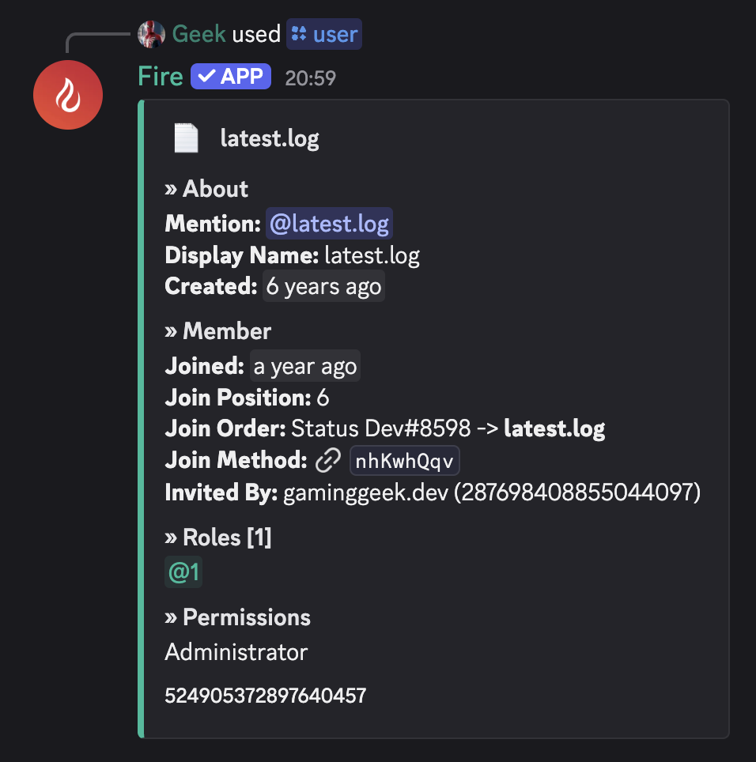
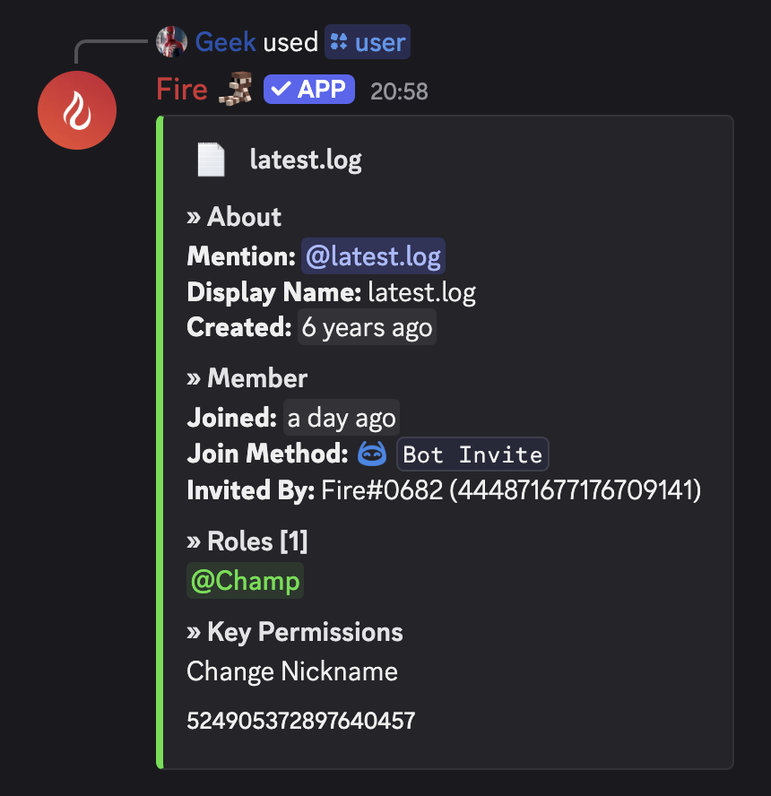
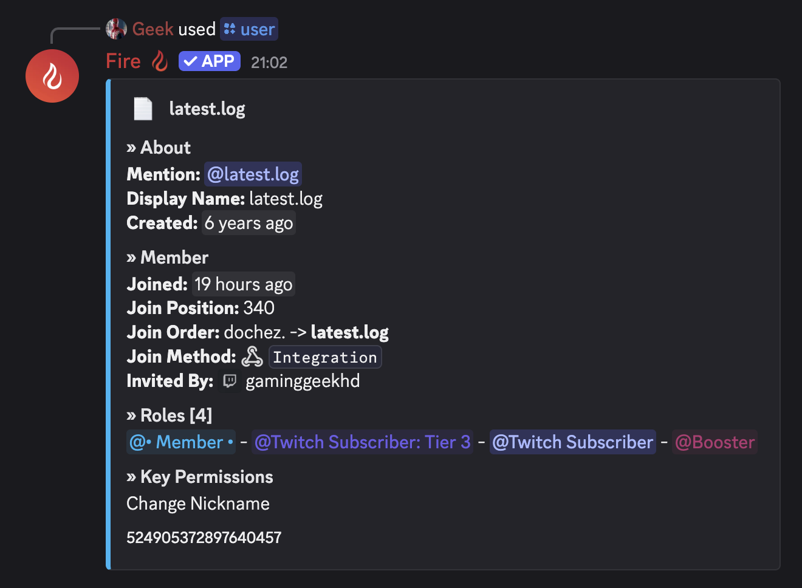

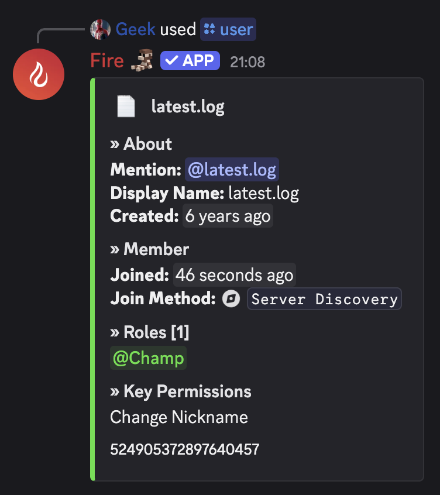

<Callout type="warn">
This information is only available for those who joined after Discord started tracking it and will therefore not always be visible
</Callout>

#### User Banner (experimental)

50% of users will now be able to see a user's banner in the `/user` command. I did not release this to everyone as I'm unsure on whether this will be liked along with limitations on Discord's end (not always receiving the banner hash, not being able to view the banner from server profiles) making it less than ideal both for performance and usability

If you have feedback on this change, I'd love to hear it in the [Fire Discord](https://inv.wtf/fire)

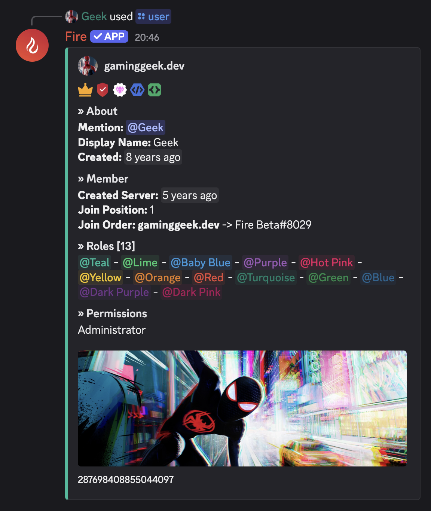

### Iterable Quotes

You can now quote a range of messages by providing a start and end link, separated by a hyphen! This allows you share groups of messages easily without needing to copy each individual link


<Callout type="warn">
Just like with regular quoting, there are limits in place to prevent abuse! By default, you can quote up to 5 extra messages and double that with [Fire+](hc/plus.md)
</Callout>

I would just like to end this by saying suck it Discord, Fire quotes are better than forwards :)

## Wednesday, March 26 2025

### Discord Timestamps for Moderation Logs

Fire has been updated to store the times for moderation logs as a timestamp, rather than a formatted string, which now allows it to use Discord's timestamp formatting feature to show it in your timezone!

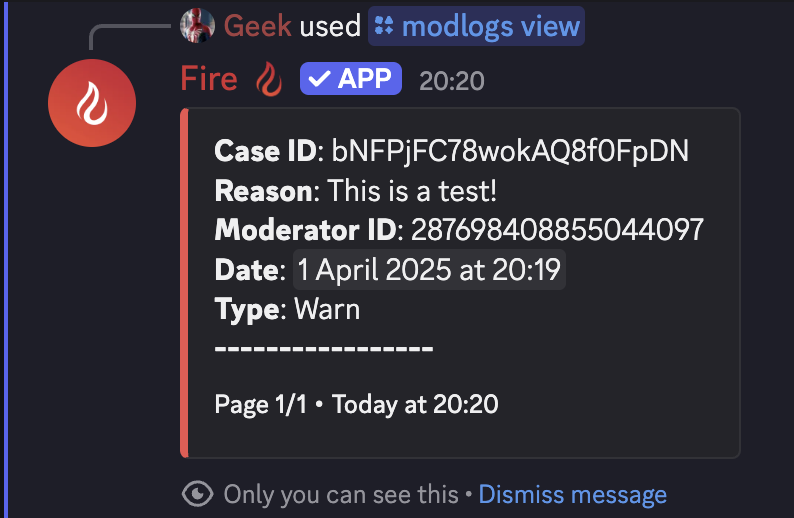

## Wednesday, March 19 2025

### Displaying Completion Time

Completed reminders will now display the time they were marked as completed on the button! This information was technically already available by checking when it was edited but this makes it much easier to see and keep track of

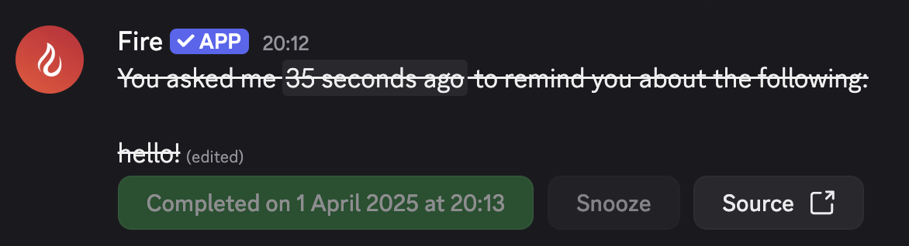
(yes, I am late to writing this changelog entry, as usual)

## Wednesday, February 19 2025

### Replacing Timezone Command

You can now set a timezone to be used in the bot using the `/time zone` command. This replaces the `/reminders timezone` command (though that is still available for now) and will be used for other parts of Fire too, such as the time argument for bans & mutes along with another new command


### Timestamp Command

If you've ever seen one of those fancy timestamps that show a time in your own timezone using various different styles and wished there was an easy way to generate them on Discord, this command is for you!

With the `/time stamp` command, you can generate a timestamp for any time & with any style. It uses the same time parsing as other areas of Fire so you can use relative time (e.g. 4 hours) or specify an exact time/date (e.g. June 3rd at 10am) and it will use the timezone you set with `/time zone` or even one you provide (e.g. 8am PST)

You also don't need to worry about remembering the letters for each style as Fire will provide a list of styles for you to choose from when you select the `style` argument

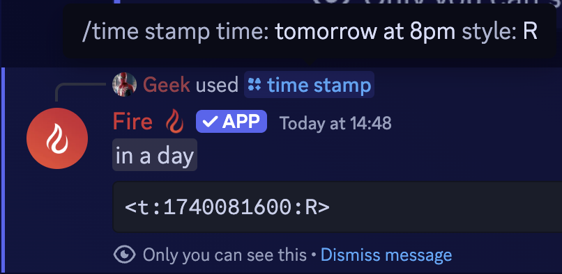

If a time or style is not provided, it will use the current time and the Short Date/Time style


### Updated Message Deletion for Bans

Instead of providing a number of days for deleting messages while banning, you will now be given the same options as Discord does with the ability to specify a custom amount in seconds if you wish (up to 604800, 7 days)


## Tuesday, February 11 2025

### Updated Vanity & Redirect Commands

The `/vanityurl` (now `/vanity`) and `/redirect` commands have been updated to use subcommands rather than all actions being in the one command, a remnant from before slash commands existed


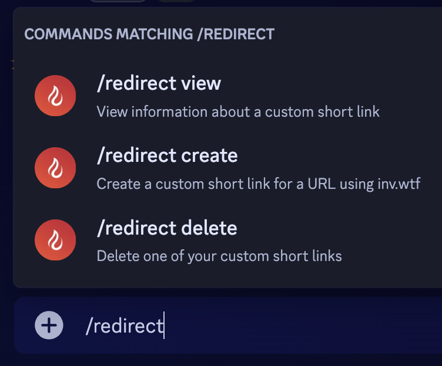

The functionality of these commands remains the same, just a lot more slash command friendly!

### Additional Vanity URLs

Fire+ subscribers can now add extra vanities to their subscription, allowing them to set more than one vanity for a server

You can learn more about this on the [Fire+ page](hc/plus.md#additional-vanity-urls)

This is a trial run of subscription add-ons and may not stick around (though if it were to be removed, existing add-ons will be kept free of charge) to see if people would be interested in adding extra features onto their subscription for a small fee

If you have any feedback, let me know in the [Fire Discord](https://inv.wtf/fire)

## Monday, January 27 2025

### New Action Log Type - Role Update

Updating roles will now be logged in action logs! This has been enabled by default for existing servers as with any new log type but can be disabled with the `/logging configure` command

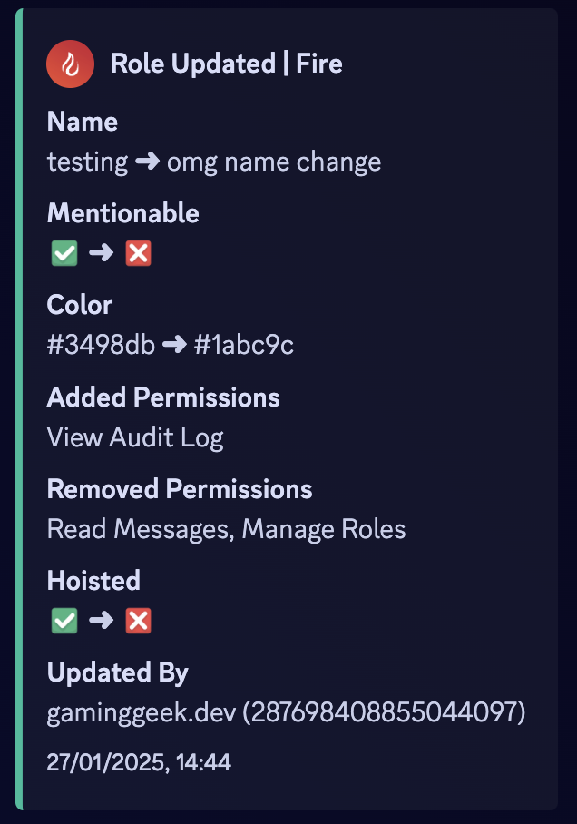

## Wednesday, January 22 2025

### Updated Reminders List Command

The `/reminders list` command has gotten a nice little revamp, allowing you to select reminders from a dropdown to view the full text (if too long for the dropdown), time it'll be sent and time it was created

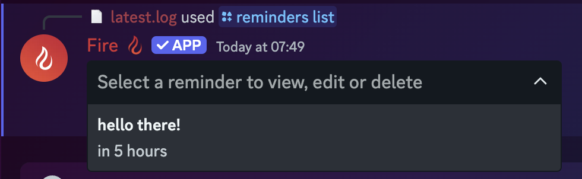

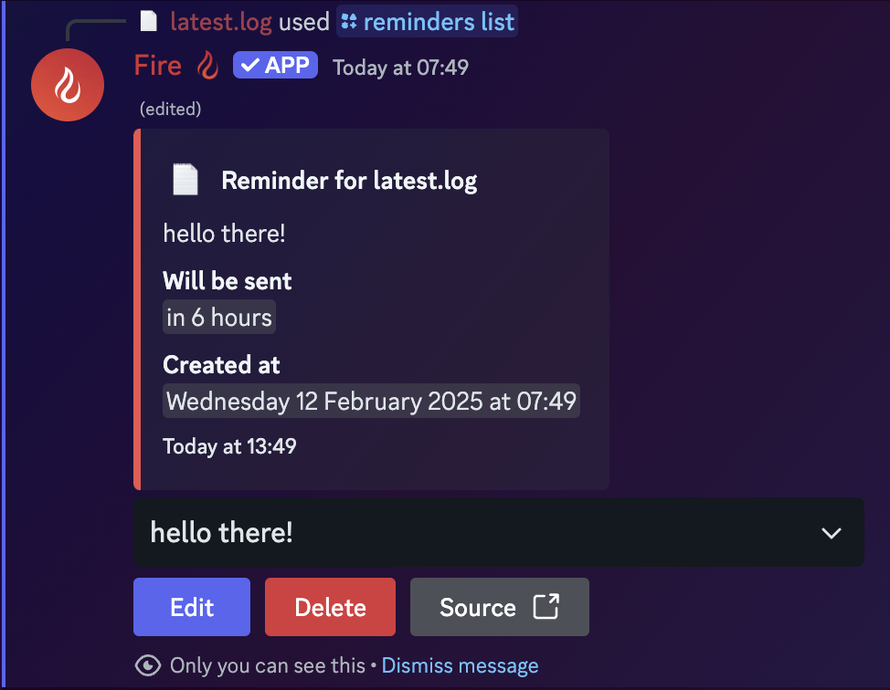

Clicking the `Edit` button will allow you to update the reminder text & time
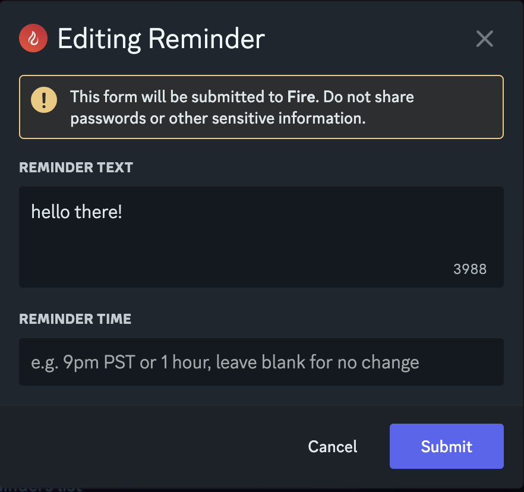

Editing reminders is currently not available outside of the `Edit` button but can be made a separate command if that is desired

### Relative Time in Reminders Delete

You can now see relative time for reminders in the autocomplete options for `/reminders delete`


### Better Error Handling for Reminders

The process for sending reminders has been rewritten to better handle failures instead of trying once and deleting the reminder no matter what. Now, it will try 3 times with a few seconds in-between and if it still fails, it will wait some time before trying again

There is also special casing for DMs being closed which will stop further attempts and set a special flag which will cause the reminders command to show an error message letting you know past reminders failed due to your DMs being closed. Once you see this error, the flag is cleared allowing you to set new reminders along with retrying older reminders

### Improved Snoozing

Snoozing had previously relied on reminders being kept in memory so it can get the data needed to re-create the reminder with your new time but has been changed to put all the necessary data in the reminder message, allowing the bot to snooze reminders whenever you want!

## Saturday, January 4 2025

Happy New Year 🎉

The first update to Fire in 2025 is not exactly a new feature in the bot but is definitely something you'll want to use 👀

### Server Member Discounts for Fire+

You can now get 10% off your Fire+ subscription just by being in the [Fire Discord](https://inv.wtf/fire), alongside the existing discounts for server boosters and [Twitch subscribers](https://inv.wtf/twitch)

If you need a reminder of what discounts boosters & subscribers can get:
- 35% off for server boosters
- 50% off for Twitch subscribers
- 75% off if you've boosted & subscribed

You can claim your custom coupon code by using the `/discount` command in the `#testing` or `#bot-commands` channels found in the Fire Discord. This code can only be redeemed by you and will expire 1 day after claiming it.

The code will automatically update if you boost/subscribe before redeeming it and your discount will automatically be adjusted if you do so after subscribing (and also if you unboost, unsubscribe or leave the server)

## Sunday, November 24 2024

### New Status Page

Fire has a shiny new status page, powered by [Intatus](https://instatus.com), rather than Atlassian's Statuspage. The switch was made due to Instatus offering a better featureset & cleaner UI (along with it being easier to recommend due to the more sane pricing)
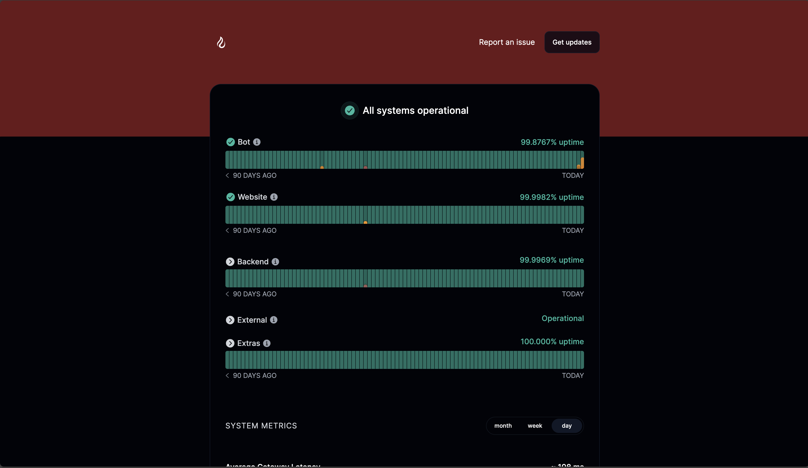

You can find it at [firestatus.link](https://firestatus.link) or you can use the `/status` command, assuming there isn't a major outage.

It will also update automatically based on existing systems to detect and send alerts regarding issues so if you see a notice with `(Automatic)`, this was posted without any intervention from me, though it also means that I have been notified of the issue and should be able to fix it ASAP

### Rewritten Configs

This is more of an internal change that doesn't really mean anything to anyone but me, however, I will now be able to do more with configs thanks to it

This includes logging of changes made to configs and who made them (i.e. for server configs) which can help with investigating issues. The values themselves are not included in this logging due to privacy & storage concerns but the value's type is saved which should be good enough

It also allows for more easily retrieving & updating configs outside of the bot itself, meaning Aether (Fire's cluster manager) and the website can now make changes to them.

## Thursday, July 18 2024

### App Emojis

Discord has now added the ability for bots to have their own emojis, just like a server does, which should mean no more issues with permissions on the `@everyone` role causing emojis to break!

Fire has been updated to support this new feature so you'll now see tooltips like this when clicking/tapping on emojis used by Fire (except in cases where user-generated content is present)


## Friday, July 12 2024

Small change and yes, it's been a while, but there's mainly been bug fixes and even more minor changes between the last entry and this one

### Role Persist can now accept a reason

The `/rolepersist` command has been updated to match other moderation commands by adding a `reason` argument which will be stored in the user's moderation logs and included in the embed sent to the server's moderation logs channel

I've no idea why it didn't have a reason argument but it does now 👍

## Friday, April 26 2024

### Save to Quote

Fire's quote feature is one of the most popular and is very handy for sharing messages but unfortunately, it relied on Fire being in the server the message is from to quote it...

Wait, *relied*? Past tense?? Yup!

Through the magic of ~~buying two of them~~ User Apps, you can now save messages from servers without Fire to quote them in servers *with* Fire

#### How to get started

First, you'll need to add Fire as a User App, which you can do by clicking the `Add App` button on Fire's profile or going to [inv.wtf/bot](https://inv.wtf/bot) then selecting `Try it now`

You can learn more about User Apps [on Discord's "Using Apps on Discord" support article](https://support.discord.com/hc/en-us/articles/21334461140375-Using-Apps-on-Discord) or [further down in the changelog](https://kb.getfire.bot/#user-apps)

#### How to save a message

To save a message, right click it then hover over `Apps` and select `Save to Quote` or if you're on mobile, tap and hold on the message then tap `Apps` and finally tap `Save to Quote`

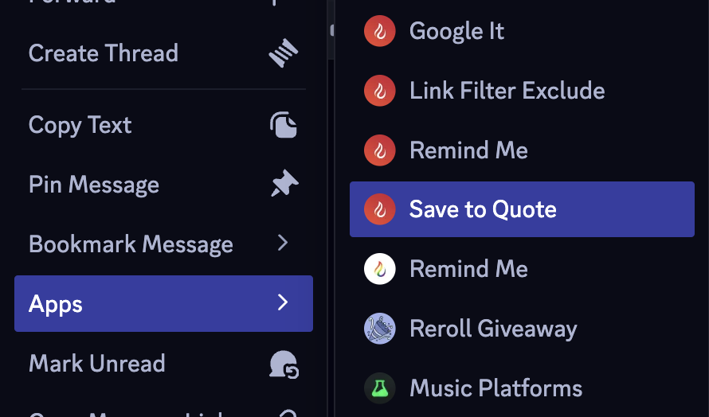

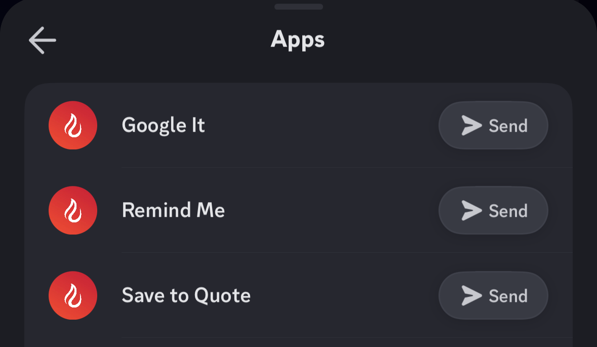

## Wednesday, March 27 2024

Finally, the Spider-Verse short film "THE SPIDER WITHIN" is being released and it actually inspired the following addition to Fire 🕸️

### Remind Me for YouTube Premieres

Picture this: Someone just sent you a super cool YouTube video link but when you go to it, it's a premiere that you need to wait for. BORING!

Now, you can have Fire remind you that the premiere is happening with a choice of times ranging from the premiere time (i.e. when the countdown starts, same time as listed on YouTube)) or 5/15/30 minutes beforehand from right inside Discord

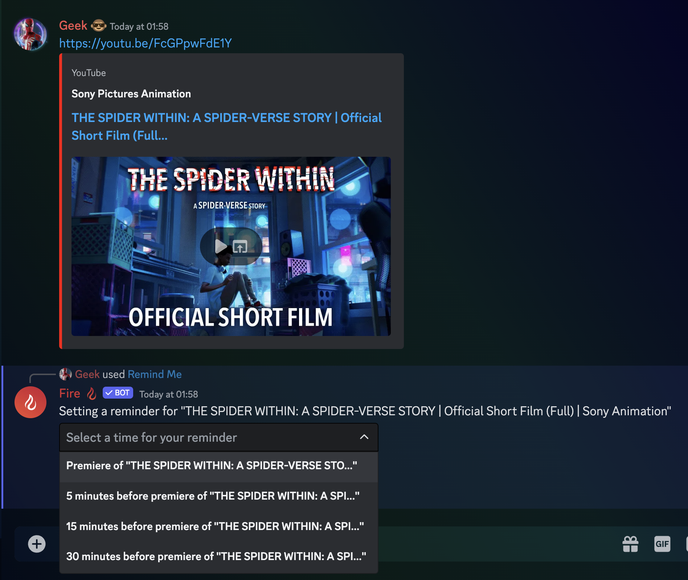

<Callout type="info">
This also works for scheduled livestreams, but it will still show as a premiere in the dropdown as they can't be differentiated (plus, premieres are more common anyways)
</Callout>

### Improved YouTube filtering

As I was adjusting Fire's YouTube stuffs, I also made some improvements to the YouTube link filter

It will now support detecting & logging multiple videos & channels and will be quick at doing so since (for videos and certain channel links) it can fetch multiple at once from Google

It should also no longer randomly send blank YouTube filter embeds or randomly stop filtering

## Friday, March 22 2024

If today was Wednesday, [Cosmo would have an idea](https://www.youtube.com/watch?v=fO-nLC8GL1M)

### Carbon changes

The `/carbon` command should no longer include random elements from the website in the image but if it happens again, report it in the [Fire Discord](https://inv.wtf/fire)

It will also attempt to use Prettier to format the input code

### Restrict command

`/modonly` & `/adminonly` have moved!

They can now be found under the `/restrict` command and have been rewritten to be much simpler. They will now toggle the restriction (i.e. only mods or only admins can run commands) in the current channel or a category if one is specified

Setting it for a category will apply to any channels in the category at the time of running a command, so you can move channels in & out to add & remove the restriction

I also have plans to add other restriction types in the future 👀

### Minor changes

The following are some changes that were made today which are too small for a dedicated section:

- Fixed reminders sometimes breaking when setting one for the minimum of 2 minutes
- Changed the duration too short string for reminders
- Added a new detection for Forge to Minecraft log scanning
- Prevented certain features from displaying in `/server` to try and avoid it breaking from being too long (looking at you Discord Townhall)
- Moved admin (Fire admin, not Discord admin, so this doesn't matter for most of you) commands to slash commands and made them a group
- Added descriptions to some command arguments, will continue to add them for more as time goes on

## Tuesday, March 19 2024

### User Apps

You can now use Fire all across Discord without being limited to servers that have added it!

When you go to add Fire or Fire Beta, you'll be asked whether you want to add it to your apps or to a server. The former will allow you to use the commands in any server and allow the bot to send you DMs without you needing to share a server with DMs open, which can help with receiving reminders

There are some limitations on Fire's side, such as only being able to use commands that can also be used in DMs and some arguments not accepting input depending on the type (for example, you can't use the `member` argument in `/color` as it doesn't receive full data for the member's roles) but aside from that, it should function the same as it normally would

You can add Fire to your apps by clicking [here](https://inv.wtf/bot) or Fire Beta by clicking [here](https://inv.wtf/betabot)

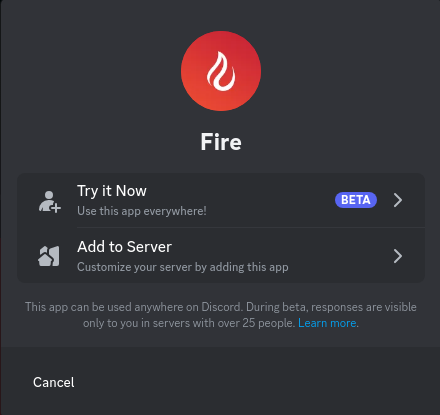

<Callout type="warn">
Responses may be ephemeral (i.e. only you can see them) depending on your permissions in the server
</Callout>

## Wednesday, March 13 2024

Woah, first changelog of the year.

I probably forgot to add stuff here from earlier in the year but I can't be bothered to add them now. To make a long story short, my MacBook broke so I'm on my PC now and I am very slow at typing on a non-mac keyboard now

Anyways, onto the changes I just deployed at midnight

### The `/reminders timezone` command

If you saw this in the changelog already, uh, no you didn't...

This command allows you to set your timezone stored in Fire for use with reminders, removing the need to specify one in the command or relying on UTC.

This command makes use of Discord's "autocomplete" feature to return a dynamic & filterable list of timezones. With nothing entered, it'll show a list of common timezones which will probably work for most people but if that's not enough, you can start typing to search through an extended list

<Callout type="warn">
This does _not_ cover the entire list of IANA timezones because I was too lazy to parse their database and it contains many duplicates (like Europe/London and Europe/Dublin which are both the same thing) but I've got what I believe will be enough to cover a large percentage of users.

You can also request that a timezone is added in the `#fire-help` channel in the [Fire Discord](https://inv.wtf/fire) and I'll get it added as soon as I can.
</Callout>


This method allows for supporting daylight savings (which is why there's two for UTC+0 with the second handling daylight savings for western Europe, such as in the UK & Ireland)

<Callout type="warn">
I've tried my best to ensure that setting a reminder for the date where the daylight savings swap occurs does not result in the wrong time but there may be some timezones where it fails to properly account for it

Thankfully, this is only an issue for two of 365/366 days in the year so I consider it a low priority issue. Timezones suck and daylight savings sucks more
</Callout>

## Wednesday, November 29 2023

You can forget about forgetting things with this update because reminders just got a whole lot better!

### Better time parsing

You no longer need to use specific keywords to set the time for reminders. Fire can now understand more casual time inputs like "today at 9pm"


<Callout type="info">
By default, it'll use UTC but you can either specify a timezone (e.g. PST or AEST) or an offset (e.g. UTC-5 or UTC+2) in the command/message or set a timezone using the `/reminders timezone` command (hi from the future, this command was added after this so scroll up to March 13 2024 to learn more)
</Callout>

The time will (most of the time) be stripped from the actual reminder text too


The old method of having things like 1d for 1 day, 2mo for 2 months etc. is still supported but is considered deprecated and may be removed at a later date. Speaking of things being removed, this update brings the removal of message command support for the remind command, however, you can still add the `--remind` flag & a time to any message to set a reminder

### Improved Snoozing

To go along with the updates to parsing times, you can now specify your own time for snoozing reminders as well as the usual presets. This can be done by selecting the `Specify other time` option at the bottom of the list and entering your time in the modal.

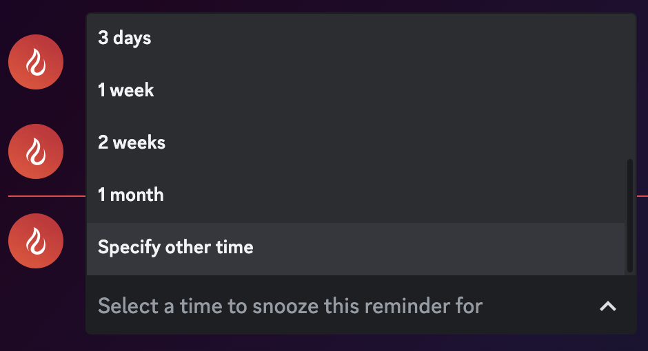


### Improved `Remind Me` context menu option

The context menu version of reminders has been upgraded too. It now allows you to pick a time from the message you've selected for the reminder, useful for getting reminded about events.

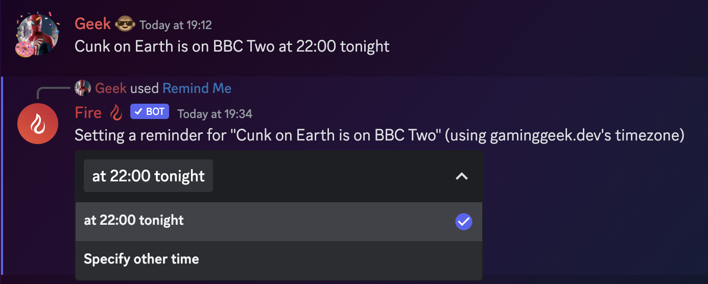
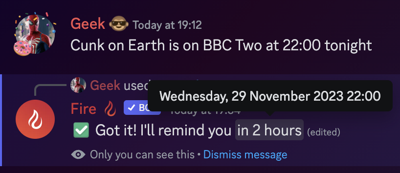

It'll still show the same presets as well as the `Specify other time` option when no time is found in the message.

## Thursday, September 7 2023

Today's update is for the Minecraft log scanning feature. If you don't use this feature, you can ignore this changelog as it won't affect you.

### Submitting solutions for Minecraft logs

<Callout type="info">
Only the user who uploaded the log & moderators can submit a solution. This is to reduce the likelihood of spam/junk solutions being submitted
</Callout>

Users can now submit solutions for logs they've uploaded if they've found a solution for their issue! Doing so requires providing an issue description and the solution which will submit it to a channel in the Fire Discord server with Geek and a handful of other knowledgable users who had access to the feature before it was available as a Fire+ perk.

Submitted solutions will be added to the bot if they can easily be identified via the log with a low chance of false positives.

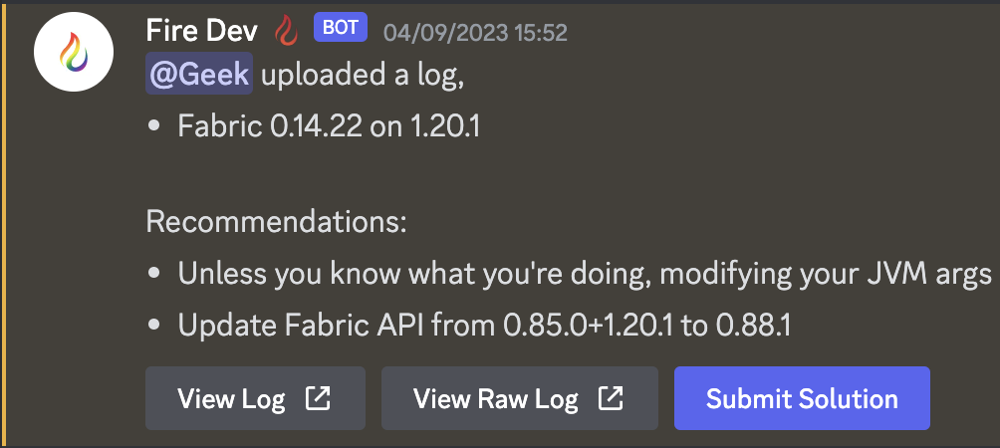


<Callout type="error">
Submitting spam/junk solutions can get you blacklisted from the log scanning feature! Only submit a solution if you it is a valid fix for the issue you describe and is relevant to the log you're submitting the solution for
</Callout>

### Control over blocking certain logs

Fire has the ability to detect certain scenarios and "block" these logs (i.e. not provide solutions/recommendations, the log can still be viewed)

This was previously limited to certain servers (well, some of it was, as I forgot to add checks to other aspects when making this feature available for Fire+ users)

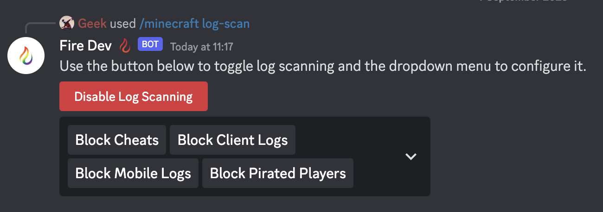

### Better mod detection for Forge

A new method for detecting mods in Forge logs has been added to broaden the scenarios that Fire can suggest updates for

This only applies to debug logs (the `debug.log` file) as Forge only logs this information on the debug level.

### Better mod detection for Fabric

A new method for detecting the mods in Fabric crash reports has been added to broaden the scenarios that Fire can suggest updates for

This applies to the separate crash report files & full logs that contain a crash report (though the mods list at the start of the log will be read first if valid & present)

### Improved blocking of PC username in logs

Previously, a pretty specific character set was used which did not include numbers & underscores. Now, the regex `\w\sÀ-ÖØ-öø-ÿ` is used for macOS & Windows usernames.

### Fixed loader & versions detection in Fabric crash reports

Fabric crash reports should now always display the loader, loader version & Minecraft version correctly unlike before where it was not correctly parsed.

### More i18n

Previously, the messages returned when a log was blocked and the "Possible Solutions" & "Recommendations" strings were hardcoded meaning they would not be tied to the active language.

They've now been added to the language files and now all of log scanning should have proper translations (for when Fire gets new languages added, feel free to help out on [Crowdin](https://inv.wtf/i18n))

## Wednesday, August 2 2023

### Better handling of system messages in quotes

Fire will now show the correct content when quoting system messages (Discord's join messages, boost messages, pinned message to channel, renamed thread etc.) rather than the actual content of the message, which is usually just part of what is being displayed

## Sunday, July 23 2023

### Display Name Support

Fire now supports Discord's display names, released alongside the new username system, and will display them in the `/user` command as well as certain other locations.

It will also now take them into account for autodehoist/autodecancer

### Improved Auto-dehoist & Auto-decancer

Speaking of autodehoist/autodecancer, these two features have been improved as well as adding display name support. It should no longer change nicknames when they meet the restrictions of either feature and will better handle resetting nicknames when they are changed to meet the restrictions

If you have any questions or issues related to these two, let me know in the [Fire Discord](https://inv.wtf/fire)

## Thursday, May 4 2023

### Yearly billing option for Fire+

You can now choose whether you pay monthly or annually, allowing greater flexibility for when you pay. It can be switched both at checkout or in the billing portal. Paying annually gives you a discount of €20 / 12 months for the price of 8

Not only can you choose when you pay for Fire+, you can now choose a custom amount of servers that you get plus for! Additional servers unfortunately cannot be added while purchasing but can be added at any time from the billing portal. Each extra server is €1.50/month or €12/year, depending on whether your base subscription is monthly or annually.

The billing portal can be accessed via https://getfire.bot/dashboard/plus or via https://inv.wtf/billing with just your Discord email


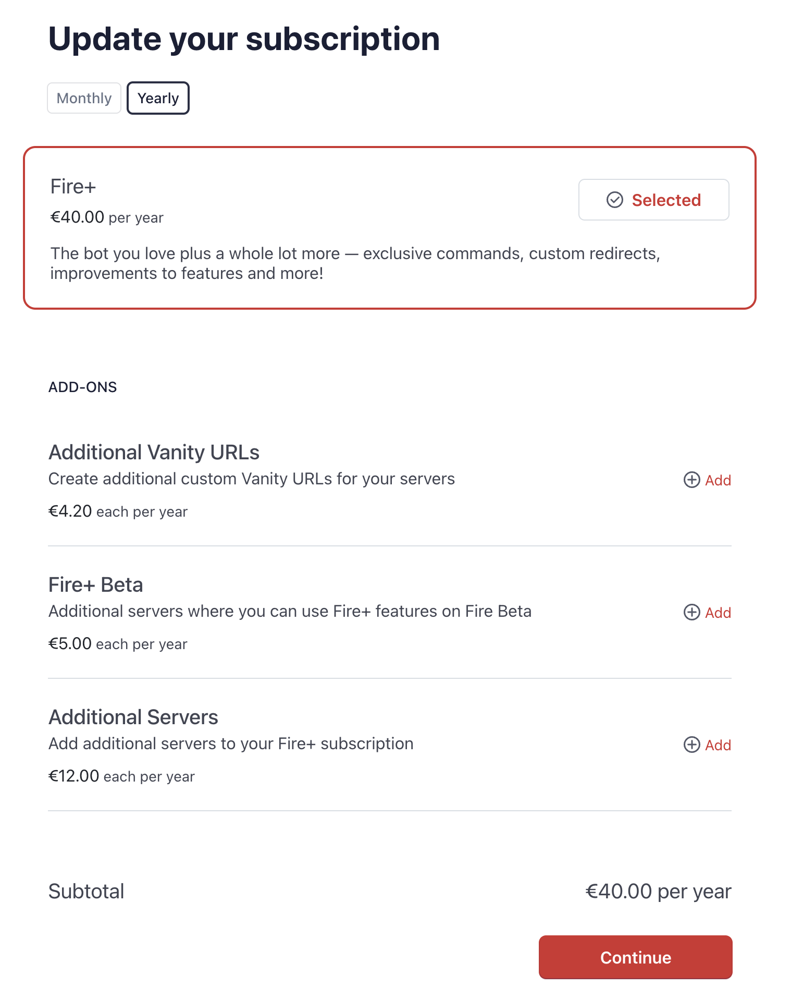

<Callout type="warn">
Additional servers cannot be added during a trial period! If you're currently in the 3 day trial period, adding additional servers will end your trial, resulting in an immediate charge.
</Callout>

### Support for new usernames

Fire will now display usernames without the discriminator (#0000 part) for users with the new username system and will use the new method for getting default avatars, which includes a new pink avatar

## Saturday, April 1 2023

### Support for Fabric mods list in Minecraft log scanning

Fire can now parse the list of mods at the start of Fabric logs and can even suggest updating for select mods

The mods it can check updates for are:
Fabric API, Iris, Sodium, Lithium, Mod Menu, Craftify, Map Helpers

If you have any mods you'd like to see added (must be on Modrinth) then you can let me know in the [Fire Discord](https://inv.wtf/fire)

### Detecting Quilt in Minecraft log scanning

Quilt can now be detected by the bot with the version shown in the message but it can't check for updates yet

## Monday, July 25 2022

(it is technically the 26th while I am writing this and when some of this was deployed but it was made on the 25th)

### Fixed token scanning

It seems GitHub no longer resets tokens in gists so I've switched Fire to using a repository instead which has brought the feature back to life.

If you don't know what Fire's token scanning is, it checks messages for Discord tokens (both user & bot) and then uploads them to GitHub to be reset to prevent malicious use.

### Added autocomplete to /ban

Discord has recently added preset reasons for banning users in the client so I've added them to the `/ban` command via autocomplete


As the last option says, you can still type a custom reason like you would before this change.

## Saturday, July 9 2022

It's been a little while since something new (other than bug fixes) have been added to Fire but I am back with an awesome utility command for y'all!

I will hopefully start working on Fire as much as I used to soon.

### Slowmode Sync

Ever notice how threads don't keep the slowmode setting of the channel they were created in? Fire can now do that for you with the `/slowmode-sync` command!

This command will toggle it server-wide and only affects new threads, not existing ones.

### Twitter Community

Fire now has a Twitter community which you can join [here](https://inv.wtf/twittercommunity)

## Monday, April 18 2022

### Incognito Mode

Ever wanted to use a command but not have it shown to everyone in the channel? Now you can use `/incognito` to make all command responses (slash commands only) ephemeral, meaning only you will see the response.

### Multi Image Embed command

You know those awesome Twitter embeds with multiple images from a Tweet? Now you can make your own with the `/multi-image-embed` command!

You can do up to 8 images (4 images per embed) and can set the color of the embeds by giving a hex color code in the `color` argument


(Could you tell that I am very excited for Doctor Strange in the Multiverse of Madness? 😂)

### Instagram Account

I made an Instagram account for Fire! Why? I dunno, I just made it while making my own so that I could mention it in my bio.

You can follow it [here](https://instagram.com/firediscordbot) and you can also follow me (Geek) on Instragram [here](https://instagram.com/gaminggeek.dev).

I'll probably post screenshots of new features on there so there's an incentive for you to follow it I guess

## Saturday, March 12 2022

### Invite Info Command

You can now use `/inviteinfo` to view info about a server, similar to `/server` but for an invite code or discord.gg link!

This command will respond ephemerally (meaning only you can see it) to avoid it being used to advertise an invite

If Fire is in the server and it is on the same cluster as the current server (or cluster 0 if in DMs) then you will get all the information from `/server` alongside information about the invite


## Friday, February 25 2022

### Customization For Logging Events

You can now customize the specific events that are logged in your moderation, members & action log channels using the `/logging configure` command!

This allows you to disable events you don't need logged making it easier to keep your logs clean and only containing what's important to your community.


## Thursday, February 24 2022

### Rewritten Link Filter Exclusion

After `/filterexcl` being disabled for months, I've finally rewritten it and re-enabled the command.

The command has a new home too! It is now usable via `/linkfilter exclude`


Toggling link filters has moved from `/linkfilter` -> `/linkfilter toggle` 

If you thought I was done with the new commands then boy do I have something for you!

You can now list exclusions without having to (un)exclude anyone or anything from the filter using `/linkfilter list-exclude`!

&#x20;

### Buttons For Bot Links

This was something small I had snuck in during the rewrite of `/linkfilter exclude`.

When running `/user` or the `User` context command on a bot, you may see some new buttons in the response...

The terms of service & privacy policy links are now buttons and I've also added a quick `Add to Server` button which functions the same as the one on the bot's profile, if the developer has set it up.


### Less False Triggers For Minecraft Log Scanning

Fire will now check to see if the content of a message contains a codeblock with a language specified and will ignore it for log scanning if one is found.

This should help prevent false triggers of the system when code is posted.

### #StandWithUkraine

I'm sure you're aware of everything happening with Russia and Ukraine by now so I want to take this time to ask that if you can, you can check the various links below to donate and help various charities supporting Ukraine with the horrible things happening there ❤🇺🇦

https://voices.org.ua/en/ https://savelife.in.ua/en/donate/ https://www.rsukraine.org/ https://armysos.com.ua/en/

## Thursday, February 17 2022

### Updated Anti Command

The `/anti` command, which is used to toggle basic message filters, has been updated to use buttons instead of a command argument.

This makes it much easier to use and allows toggling filters with a single click

You can check out a demo of the new command [here](https://static.inv.wtf/updated_anti_command.mp4)

If you have any suggestions for new message filters, you can let me know in the [Fire Discord](https://inv.wtf/fire)

### Updated Linkfilter Command

Keeping with the trend of message filters, the `/linkfilter` command has been updated to use a dropdown instead of a command argument.

This allows you to easily toggle multiple filters at once and disable them all by selecting the `Disable All Filters` option.

You can check out a demo of the new command [here](https://static.inv.wtf/updated_linkfilter_command.mp4)

If you have any suggestions for other link filters, you can let me know in the [Fire Discord](https://inv.wtf/fire)

## Tuesday, February 15 2022

### Editing Tags with Modals

The `Edit Tag` button in the `/tag info` command will now open a modal for you to rename the tag and edit the content.

The `/tag edit` command will switch to using this modal in the future once more users have updated to newer versions of the Discord client

### Carbon Now Uses Modals

Another area of Fire now using modals is the `/carbon` commnd. You now only select the theme & font in the command and you will be presented with a modal to enter your code.

## Saturday, February 12 2022

### Bug Fixes

Issues with slash tags responding saying "Command not found" and snoozing reminders have been fixed.

## Thursday, February 10 2022

### Modals

Discord has released a new interaction response type, modals!

Unfortunately I was not part of the beta for this feature so this is the first time I've broken the tradition of having new features on day one. (They released on the 9th at midnight, I added them to Fire on the 10th at 8pm)


This is just the first place they'll be used in Fire with more coming soon.

Make sure you update your client so you can see the new modals!

## Friday, January 21 2022

### Fire+ Discounts

You can now get exclusive discount codes when boosting the [Fire Discord](https://inv.wtf/fire) and/or subscribing to Geek, the developer of Fire on [Twitch](https://inv.wtf/twitch)

To claim your discount code, you can use the `/discount` command in the Fire Discord to claim a discount code for plus ranging from 35% off up to 75% off!

You get 35% off by boosting, 50% off by subscribing and 75% off if you are both a booster and subscriber!

The discount code expires after 24 hours and you will only see it once so make sure to take note of it after running the command. The discount lasts until you leave the server or unboost/unsubscribe

## Sunday, January 2 2022

Happy new year! 🎉

2021 was an amazing year for Fire and I hope 2022 will be even better.

I have a couple changes, including a very popular feature now being available to the general public with Fire+!

### New Website Beta

The current Fire website hasn't been worked on in quite a while and is pretty broken. This is because my good friend and amazing web developer, [bruno](https://bruno.codes) has been working on an updated version.

I am happy to say that I've now made this ongoing rewrite accessible at [getfire.bot](https://getfire.bot) for users to try out!

It may be buggy and is currently not great on mobile so if you encounter any bugs or have any questions/suggestions, please let me know in the [#fire-help channel](https://canary.discord.com/channels/564052798044504084/564067823014641664) in the [Fire Discord server](https://inv.wtf/fire).

As a little treat for helping test the new website, you can use code `NEWYEAR22` to get 22% off Fire+ (valid until January 31st at 23:59 UTC), which you can purchase through the website by logging in, clicking your avatar and selecting `Fire+` in the dropdown menu. This new system for buying plus requires no manual intervention from me unlike the current one and allows you to select the server(s) you want plus in on the website!

I hope you enjoy the new website!

### Renamed Commands

The `/mcuuid` and `/skin` commands have been moved to subcommands of `/minecraft`

To use these commands, it is now `/minecraft uuid <ign>` and `/minecraft skin <ign>` respectively.

### Minecraft Log Scanning

Keeping to the block game theme, this highly popular feature seen in servers like Sk1er's Epic Server, ESSENTIAL Mod, Skytils & more is now available to the general public!

This feature requires Fire+ as it is quite resource intensive with it potentially loading a couple megabytes worth of data into memory, running many regexes on it and then checking for known solutions and recommendations by matching strings.

It can be enabled with `/minecraft log-scan` and works with attachments, select pastebin/hastebin service links & sending the text directly.

If you have any questions about or find any issues with this feature, please let me know in the #plus-support channel in the [Fire Discord server](https://inv.wtf/fire). You can also help improve this feature by providing sample logs and the matching solutions or recommendations in this channel.

## Monday, December 20 2021

It's been a while since the last changelog entry but that doesn't mean I haven't been busy...

I've mostly been working on improving Fire's slash commands in preparation of going slash only 👀

You can see all the changes in [Fire Beta](https://inv.wtf/betabot) though do note that the beta is, well, still in beta so I would recommend not replacing Fire with the beta.

Anyways, time for the things you came here for, the production bot changes!

### Timeouts

Discord has _finally_ added a native muting solution and in true Fire fashion, it already has support for it!!!

Unfortunately, they are limited to 28 days in the future so for longer mutes, the `Muted` role (or whichever role you set with the `/muterole` command) will still be used.

This change also comes with the removal of the minimum time for mutes

N.B.: To make use of timeouts, Fire will need the **Moderate Members** permission so if it isn't using timeouts, make sure to check your muting for less than 28 days and it has the appropriate permission.

## Wednesday, October 20 2021

### Changes to quote appearance

Quotes will now use your server profile (nickname & server avatar) rather than your global avatar and _only_ your username.


Thanks to [UserTeemu](https://github.com/UserTeemu) for submitting [this change](https://github.com/FireDiscordBot/bot/pull/117)!

## Friday, October 1 2021

### New Help Command

Fire's help command has been updated to be much more clean and concise rather than the large embed it used to be.

Now you can use the dropdown menu to select a command category rather than seeing them all at once.

 

Selecting a category will edit the message rather than sending a new one and it won't timeout so you can use the same embed and select a category weeks later and it'll show you the latest commands in that category.

### Slash Command Upsells

You may see have seen some changes to Fire with regards to slash commands. These changes have a few prerequisites so you won't see it in all servers so if you don't see a difference, that's why.

---

- If you're still using message commands (and the server meets these prerequisites), you have a chance to be prompted with a message letting you know about Fire's switch to slash commands. This message will change depending on whether or not you have Fire's slash commands added to the server or not and if not, whether you can add them.
- The new and improved help command (which is available for everyone) will also change if you're still using message commands (and the server meets the prerequisites), any command that is only available via slash commands will be crossed out in the help command with a note telling you to switch, alongside the same message from above.
- The final change is with moderation commands, specifically the mod actions like warn, kick, ban etc. In some servers (mainly larger communities) you will see a warning attached to the responses of these commands letting you know that they will eventually be available via slash commands only.

---

All three changes will be enabled in more servers as time goes on to ensure everyone using Fire is aware of the switch. These changes are on Fire Beta too alongside the better slash commands.

I hope to have those changes merged sometime between the middle of and end of November, allowing time for these "upsells" to reach most users. allowing them to be ready for the change.

## Monday, September 27 2021

### Better slash commands

Fire no longer relies on creating fake content to parse commands from slash commands!

Before it would take the arguments from the slash command and create the content that a user would've written as if it was a message command and parsed it from that.

This, alongside creating fake Message & Channel classes, is what allowed me to get slash commands working in Fire a couple hours after their release but since I am migrating to slash commands only, I thought I'd improve it a bit.

**What does this mean for you?**

- Quicker response times (you probably won't notice this though, it's only a minor improvement)
- Better error handling with ephemeral errors
- Allowing users to run slash commands in modonly/adminonly channels by forcing them to be ephemeral

This involved a large rewrite of command handling so there may be issues with it. If you encounter any, let me know in [#fire-help](https://inv.wtf/fire) and feel free to ping me.

I've also updated the warn command to be slash only on Fire Beta just like I did with mute & unmute. The rest of the moderation commands will come soon.

## Tuesday, September 21 2021

### WIP Moderation (Slash) Commands Overhaul

I have started working on making moderation slash commands better (since currently they suck) and have started with mute & unmute. These changes are on a separate branch (`feature/moderation-slash-commands`) and this branch will be auto deployed to [Fire Beta](https://inv.wtf/betabot)

If you have any feedback, feel free to leave it in [#fire-help](https://inv.wtf/fire)

This won't be merged into master when complete, only when I am ready to flip the switch on making moderation commands slash commands only (the way mute/unmute are in Fire Beta now)

### Autocomplete

Got some more juicy slash command updates for y'all 👀

Following the Discord Developers Q\&A earlier, I have implemented one of the features shown into Fire, autocomplete!

That's right, some commands will now automagically provide you with choices to choose from for running the command. One example being returning commands in the `help`, `command` & `debug` commands (currently shows ALL commands, will eventually be filtered to ones you can use/manage) or returning tags in the tag commands!

To use this amazing new feature, you must be on the latest version of the Discord app

If you encounter any issues with these, let me know in [#fire-help](https://inv.wtf/fire) and feel free to ping me for them.

  

## Monday, August 23 2021 / Tuesday, August 24 2021

Today I am pushing a lot of changes to [Fire Beta](https://inv.wtf/betabot) that will soon be deployed to production. This changelog is going out early to allow users to provide feedback on these changes as they are quite major and I will not be surprised if there are users with negative opinions on the changes.

**Edit - 20:12 UTC, August 24th 2021 - These changes have since been deployed to the main bot.**

If you have feedback you want to give, you can join the [Fire Discord](https://inv.wtf/fire) and leave it in the #fire-help channel or email it to [feedback@getfire.bot](mailto:feedback@getfire.bot) if you want to provide feedback privately

### Miscellaneous Stuff

I have re-enabled the Discord experiment fetching in Aether and subsequently "fixed" showing guild experiments (this will also fix Advaith's [Experiment Rollout site](https://rollouts.advaith.io))

I have also fixed a potential bypass for invite filtering.

### Steal Command

The steal command was disabled on August 17th following advice I had received from a Discord employee which you can see below or [click here](https://canary.discord.com/channels/613425648685547541/696891424041598978/877251437388771388) to view the messages in [Discord Developers](https://discord.gg/discord-developers)


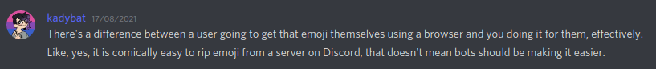

After a bit of consideration, I have decided to rename the command rather than remove it due to how useful it can be f.ex for mobile users wanting to upload emojis

The command has been renamed from `steal` to `emoji` and now takes either an existing emoji, emoji URL, attachment URL or attached image when running the command.

Due to these changes, I had to swap the order of the arguments. The emoji name comes first and then the emoji/URL. I have tried my best to make it smart enough to figure out if you reversed them but it's not guaranteed to work. Please put the emoji name first and \*then\* the emoji.

### Updated Invite Command

The invite command no longer links to [https://inv.wtf/bot](https://inv.wtf/bot) but now has a button you can click to go directly to the invite.

This change was made to allow for using In-App OAuth which (last time I checked) is available to 50% of users on desktop

### Disabled Prefix Slash Command

It just didn't make sense to have something that only works for message commands, as a slash command...

### Removed Autoquote Command

The `autoquote` command was used to toggle automatic quoting when a message link was found in a message.

This has now been replaced with a check for whether the `quote` command is disabled. Disabling the quote command will now disable auto quoting.

### Removed Message Collectors

A few commands (such as `close` and `delremind`) have been updated to **only use buttons** rather than waiting for a message. You can no longer type `close` to close a ticket or `yes` to delete a reminder.

### Added New Tag Subcommands

`/tag list` & `/tag view <tag>` have been added to replicate functionality of the base tag command with slash commands as you cannot use `/tag` like you can use `$tag`

### Forcing Slash Commands

This is the more controversial part of this update...

32 commands in Fire (approximately 29% of all commands) are no longer usable via messages. Attempting to use these commands will prompt you to use slash commands instead.

This change was made to encourage the use of slash commands amidst the [upcoming message intent changes](https://support-dev.discord.com/hc/en-us/articles/4404772028055-Message-Content-Access-Deprecation-for-Verified-Bots) in April 2022. Fire will eventually be usable via slash commands only and this is the first step towards that.

The decision to go slash commands only was already made before the whole message intent announcement but was pushed forward because of it.

I understand that some of you may not like slash commands in their current state and I assure you there are improvements coming!

## Tuesday, August 10 2021

### Context Menus

Today Discord has released `Context Menu Commands` that allow bots to add actions to right-click menus on both users and messages (more will come) and Fire has full (hacky, but full) support for them!

Once you're on the latest version of the Discord desktop app (no mobile support for now), you should be able to right click users to see a `User` option in the `Apps` menu which you can use to get information about the user you right clicked (it's the same as doing `/user @TheUserYouClicked`)

You can also right click messages and see two options, `Google It` and `Remind Me` with will run `/google <the message content>` and `/remind <the message content>` respectively, with a twist!

The `Remind Me` option will give you a dropdown with predefined times for setting a reminder rather than you entering a time since this is all I can really do without a text input component.

## Friday, July 9 2021

### Filter Exclude Command Disabled

The `$filterexcl` command has been temporary disabled until I can get around to rewriting it as it seeming has many issues that were recently made apparent to me through its usage of incorrect strings. I have no clue when I will be able to rewrite it and re-enable it so I can't tell you when it will be back

All existing filter exclusions are still in effect. if anyone **needs** it to be changed, please join the [Fire Discord](https://inv.wtf/fire) and let me know in the #fire-help channel as I can manually edit it.

## Tuesday, July 6 2021

### i18n Rewrite

Fire is now using the i18n rewrite which means soon you should get more languages to choose from in the bot. I'd like to give a big thank you to everyone who has already contributed translations on Fire's Crowdin page ([https://inv.wtf/i18n](https://inv.wtf/i18n)) and at the weekend I will be approving translations and adding them to the bot alongside giving flags and roles\*

One small downside of the i18n rewrite being deployed now is that I had to remove the owo "language" for now as I haven't had a chance to rework that yet. Any user/server that had been using owo will see it once it's readded, your configs haven't been changed.

\*Unfortunately I cannot give the 50% for Fire+ yet as I can only do that once the new website has been launched

### Discord.JS Fork

Fire is also using my own fork of Discord.JS which re-adds structures to prevent me having to basically rewrite Fire. This is not a permanent solution but it will do for now. I'm still trying to decide how I will approach rewriting Fire, whether it'll just be working around the lack of structures, using a different library or another full rewrite of Fire in a different language.

### Snoozing Reminders

You can now snooze reminders! Too busy to handle a reminder the second you get it? Just click the blurple snooze button, pick a time from the dropdown and voilà, you will now be reminded at a later date!\
You can check out a demo video [here](https://youtu.be/Yu4fES-hHVQ)

## Thursday, July 1 2021

### Fire is now on Crowdin

You can now help translate Fire into new languages by heading to [https://crowdin.com/project/fire-discord-bot](https://crowdin.com/project/fire-discord-bot) (shortlink: [https://inv.wtf/i18n](https://inv.wtf/i18n))

This will help Fire be introduced to a wider range of communities. I've gone ahead and added \~30 languages to the list to be translated but if a language you want to translate isn't there, feel free to @ me and I'll get it added, same goes for if you have any questions e.g. how/where a certain string is used.

To reward translators, anyone who contributes a decent amount of translations will get 50% off Fire+ for a year and the flag for the language(s) you translated will appear next to your badges in the user command (and maybe a role here with a secret channel but I'm still unsure on whether I want to add to the already long list of roles lol)

The code changes required to support the new i18n system haven't been merged yet so if one of y'all speedruns translating a language, it might be a week or two before it can be added to Fire so be patient

One last thing, some strings will be ones you can take from Discord (e.g. permissions) so whenever possible please use any available Discord translations.

## Monday, June 28 2021

### Threads Support

With the limited release of threads for bot developers (a.k.a anyone with 5 or less members in a server, one of which must be a bot), I thought I should mention that Fire fully supports threads! Anyone taking advantage of the early access will see new logging events for threads and full support for quotes in/from\*\* threads.

Thread Log Events\*:

- Thread Create
- Thread Delete
- Thread Members Update
- Thread Update

#### Notes on commands inside threads

Running a message command in a thread Fire can see but is not a member off will cause Fire to try join the thread. If the thread is (somehow) archived or Fire is missing permissions (manage threads for private, view channels for public/announcement), it will not be able to join the thread and the command will not run. You will not receive any feedback if this happens.

**It is recommended to use slash commands in threads.**

#### Notes on ticket threads

(No idea what ticket threads are? Check out [this video](https://youtu.be/8JnrotShzA4) I made showing them)

As some of you may have heard, private threads have been locked behind a paywall (Boost Level 2 a.k.a $75/month) which has put that feature on pause for now. If this does not get reverted, one of two things will happen;

- The code for it just gets deleted
- It is available for select guilds, similar to the Minecraft logs feature

I really wanted to have this feature available for everyone on release but if it stays behind a paywall then I am unsure whether I want a public feature in Fire that requires boosts. Currently less than 50 of Fire's servers (roughly equivalent to 4% of the total servers it is in) have enough boosts to use private threads.

\* Fire may need the Manage Threads permission to correctly log events from private threads, otherwise it may log creates/deletes as it is added/removed from a private thread\
\*\* Quoting from a thread will require you to be in the thread, even if it is a public/announcement thread.

## Wednesday, May 26 2021

### Buttons

Buttons are finally here!

Discord has just released the next addition to its interactions API, buttons! These allow bots to do a bunch of cool new things and in true Fire fashion, it already has support! (It's technically had support for weeks now lol)

You should start to see buttons replacing reactions in Fire, for example with any paginators. There's also buttons hanging around in a few commands to provide quick access to helpful features.

The best way to try out these brand spanking new clicky bois is with the `$tictactoe` command. Find a friend and have fun playing against them in this classic game.

**If you can't see buttons, make sure you update your client!**

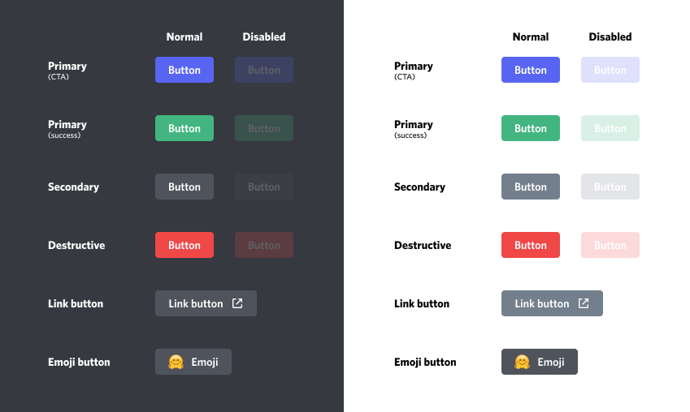

## Wednesday, March 31 2021

### Per Channel Voice Regions

Discord seems to have fully rolled out per channel voice regions, and Fire now has support for them! It will now log changes to channel regions and display all regions in the `$guild` command. It supports both normal voice channels and stage channels. Support for stage channels should also be available for [voice channel roles](hc/plus.md#voice-channel-roles).

## Friday, March 26 2021

### Starboard

Ever want to pin a message but you've hit Discord's limit of 50 pins in a channel? A good alternative to pins is a starboard, which you can now make with Fire!

With Fire you can setup a starboard channel, set the amount of stars required to be added to the starboard and Fire+ users can even use a custom emoji!\* Learn more about Fire+ [here](hc/plus.md).

Just run `$starboard` or `/starboard` to get **star**ted (get it? star-ted because star-board haha I'm hilarious)

\*I am open to making custom starboard emojis available for non-plus users a little while after the release depending on some statistics and if it is requested enough.

## Thursday, March 25 2021

### Slash Commands Release

Slash commands are finally out of beta! You should now see Fire's slash commands in all servers with the bot and new ones invited using [https://inv.wtf/bot](https://inv.wtf/bot)!

Almost all of Fire's commands are available for use with slash commands and should function the exact same as message commands (aside from some reaction workarounds)

Go ahead and hit / and start using the awesome slash commands Fire has to offer :D

## Saturday, March 20 2021

### Fire Beta Is Back Online

Fire Beta is back online! 🎉

Unlike what I originally planned, it is running on the same VPS as the normal bot but has a separate database for everything and is starting from a completely clean slate.

It's prefix is `beta` and has the same slash commands as the main bot. This bot will be used to test new & potentially breaking features in a production-like environment so **do not expect the bot to be stable** (but what you _can_ expect is pretty similar uptime to normal Fire as I'll be using Fire#7414 solely for local testing from now on and Fire Beta will stay running on the VPS)

If you would like to invite Fire Beta, you can now use [https://inv.wtf/betabot](https://inv.wtf/betabot) to invite it.

Any issues with Fire Beta should not go to #fire-help but rather [https://inv.wtf/betabugreport](https://inv.wtf/betabugreport)

## Tuesday, March 16 2021

### Permission Roles

Permission roles allow you to set permissions for a role in a channel, run a command (in the channel with the permissions) and have them copied to all other channels, including new ones!

This is useful for roles such as a "No External Emojis" role that denies `Use External Emoji` for those pesky users using NSFW emotes or a "Bad Memer" role that denies `Attach Files` and `Embed Links` for those who can't help but use their image perms to be disruptive.

Currently permission roles are limited to 1 permission role for non-plus servers and unlimited for plus servers, which you can learn more about [here](hc/plus.md)

### Behind The Scenes Changes

Over the past little while I've been making a bunch of behind the scenes changes to improve existing features, reliability of the bot itself and working on the website rewrite (alongside amazing web devs, [Bruno](https://bruno.codes) and [Nystrex](https://nystrex.com) who have done pretty much all of the frontend work) which will include migration from Patreon to Stripe for Fire+.

There's still a lot more behind the scenes changes coming which will make Fire even better than it already is (yes, it is indeed possible to make the best bot better 😂)

## Monday, March 8 2021

### Slash Command Tags

Yup, that's right, I have made Fire replace [advaith's Slashtags bot](https://discordextremelist.xyz/en-US/bots/slashtags)!

I have enabled an experiment in a small number of guilds that gives access to the `tag slash` command, allowing you to toggle slash command tags for that guild (and by providing a boolean, e.g.`$tag slash true` you can change whether or not the tags will be ephemeral)


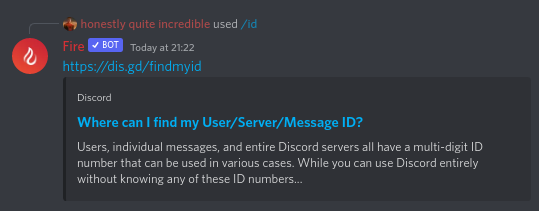

If your guild doesn't have access to slash command tags, don't fret, it will eventually be available to all guilds. I am doing a slow rollout because there's strict ratelimits on slash command stuff so I want to make sure hundreds of guilds aren't toggling slash command tags in a short period of time.

If you'd like access, join the [Fire Discord](https://inv.wtf/fire) and let me know why you think your guild should have it in the #fire-help channel :)

## Sunday, March 7 2021

### Add Lock To Ticket Creation

Sometimes when creating a ticket, if a user managed to run the command multiple times in quick succession, they could open more tickets than the server's limit (especially if said limit is 1), causing one or more of those channels to not be considered tickets, meaning `$close` would not work.

Creating tickets now uses a semaphore to ensure it is only being ran \*insert server ticket limit\* times or less at once, meaning these issues should cease to exist!

## Wednesday, March 3 2021

### Multiple Prefixes

You can now have multiple prefixes! That's it, that's the changelog :D

## Tuesday, February 23 2021

### Icon Command

"Ok, hear me out. Imagine the avatar command, but instead of showing a users avatar, it shows the guild's icon" thus the icon command was born! Wow, isn't that a great story?


## Friday, February 12 2021

### Temp Bans

You can now temporarily ban a user from your server. It's basically the mute command now except banning instead of muting (especially since the temp ban code is copied from mute lol)

e.g. `$ban advaith#9121 too much blob 1 day`

### Fixed Incorrect Global Ban Info

Sometimes the user command would say someone is banned on KSoft.Si when they're not. It no longer does this. Epic.

### Public Guild Info

The guild command can now display info for public guilds, such as discoverable guilds or ones that have made their guild public with the `$public` command.

### Basic Message Filters

With the `$anti` command, you can now enable some **basic** message filters such as deleting messages with @everyone or @here if the user doesn't have permission to use them, messages from selfbots (users sending an embed) or "spoiler abuse"

## Wednesday, February 10 2021

### Ticket Alert Role

You can now set a role that will be "alerted" (pinged) when a new ticket is opened, allowing you to f.ex. notify the staff team of a new ticket so they can have super fast response times.

You can set this the same way you set the rest of the ticket config options, `$ticket alert <role>`

### Close Pointless Tickets

Another ticket related addition, any ticket where the author leaves after not saying anything at all in the ticket will now be closed automatically so people who open a ticket for no reason then leave won't waste your time.

### Ignore Bots

Bots will now be ignored for join/leave messages (logs are unaffected) as they do not deserve to be welcomed smh

### Ignore Channels From Logging

You can now ignore channels from logging with the `$logignore` command so message edits/deletes, purges, link filter triggers etc. will not be logged from the channels you specify.

No more accidental leaks from your secret channel where you post only the spiciest of memes when you accidentally edited that one message

### Bam

I'll let you figure this one out yourself. Long awaited suggestion from Noctember#6660 ;)

### New Log Types

Previously locked to guilds with an experiment, I've just flipped the non-existent switch that enables both role update & nickname update logging for all guilds with member logs enabled.

This may cause issues so if needed, the non-existent switch may be flipped again to disable them to prevent further issues.

### Logging Changes For Large Guilds

Guilds with over 1,000 are no longer able to set multiple log types in the same channel. This is to prevent logs getting clogged up in large guilds due to the amount of logs being sent as Fire can only send 5 messages before it needs to wait a bit until it can send again.

Attempting to set multiple log types in a single channel will return an error and existing large guilds with multiple log types in one channel will have those log types automatically disabled and a message sent in the log channel to explain why.

## Tuesday, February 9 2021

### DM Slash Commands

Discord has recently released the ability to use slash commands in a bot's DMs and Fire now fully supports them. I _tried_ to prepare for this when it was announced but it still broke when it was released.

If you spot any bugs with slash commands in DMs, feel free to open an issue on Fire's GitHub repo, [https://inv.wtf/github](https://inv.wtf/github)

### Per-Server Blacklist

You can now "plonk" users from the bot in your guild! Just run `$plonk @User#1337` to prevent a user from running Fire commands. Run `$unplonk @User#1337` to allow them to use commands again.

### Reaction Roles

Only took over a year but I have finally rewritten Fire's reaction roles and it is better than ever!\
You can check out the demo video I recorded during development [here](https://static.inv.wtf/reactrolesdemo.mp4) which basically showcases the feature as a whole in a short 30 second clip.

This feature is **plus only**! You can learn more about Fire+ [here](hc/plus.md).

## Thursday, February 4 2021

### Carbon Command

That's right, you can now use your favorite bot to generate beautiful images of your code using [carbon.now.sh](https://carbon.now.sh)!

This feature was inspired by [Ravy](https://ravy.pink)'s bot [Aero](https://aero.bot) but is better because it has transparency and the ability to switch theme & font with flags

e.g. `$carbon console.log("Hello, World") --theme nord --font firacode`

Due to limitations with Akairo, the command framework Fire uses, you can't have spaces in the flag values (but it fuzzy matches so it's fine)

## Tuesday, February 2 2021

### Ticket Descriptions

You can now set ticket descriptions! These will be shown in the embed sent in new ticket channels, allowing you to give a message to a user (e.g. telling them what info they should provide)

Use `$ticket description <description>` to set the description or `$ticket description` to reset it

### Embed Command

You can now use Fire to send embeds since users cannot. This command works by taking an embed object from a haste service ([hastebin.com](https://hastebin.com), [hasteb.in](https://hasteb.in) or [hst.sh](https://hst.sh)) and send it to the current channel or any other channel!

e.g. `$embed https://hst.sh/kaxesebivo.json #testing`

You must have **Embed Links** permission to run the command and **Manage Messages** in a channel to send to it from a different channel.

## Wednesday, January 27 2021

### Colo(u)r Command

That's right, it only took a year since it was suggested but Fire now has a color command!\
Don't worry, if your language is set to en-GB, it will say colour.

Simply run `$color [<color>]` to quickly convert colors to different types (hex, rgb, hsl or hsv) and get a preview of that color!\
If you don't provide a color, a random one will be chosen.

## Tuesday, January 19 2021

### Fire Has Turned Blue!

Okay, not literally, but Fire has been fully rewritten in TypeScript (the TypeScript logo is blue haha get it)

This is a MAJOR change for Fire as every aspect has been rewritten and improved. I unfortunately can't go over every single change or improvement but I'll list a few highlights below

#### Replies Support

Fire will now use replies when sending error message, the ping command and also when using tags (if you reply to a message with a tag, Fire will reply to that message with the tag content, mentioning the user. Works best with the `dtag` alias)

#### Better Tags

You can now edit tags and give them aliases! This is long overdue 😂

#### Better "Decancering"

With autodecancer enabled, Fire will now attempt to normalise a users name if it is "cancerous" (man I hate this terminology) which means no more `John Doe 1337` for `𝖙𝖍𝖚𝖌 𝖑𝖎𝖋𝖊#1337` over there, instead they will be nicknamed `thug life`

Members will also be checked for hoisted/cancerous names on message and member update meaning less hoisted/cancerous users.

#### Slash Commands

Discord's long promised slash commands have finally released and Fire Beta supported them within 48 hours of release for 50 commands (which is sadly the limit) and since the rewrite has been deployed, normal Fire supports them too!

You will need to grant Fire the `applications.commands` scope to access slash commands, which you can do by heading to [inv.wtf/bot](https://inv.wtf/bot) and reinviting Fire with the scope.

#### Autorole For All

Autorole is no longer a Fire+ feature and is available to all servers with Fire! I've also added a bit of spice to the command in the rewrite, allowing you to set a bot autorole as well as normal autorole.

This also supports Discord's membership screening feature meaning users will not get the role before passing screening.

#### Moderation Overhaul

Moderation has been overhauled in the rewrite due to the flexibility of discord.js allowing me to have custom guild, member & user classes. This allows for cleaner code and easily allows me to add more moderation features.

Moderator IDs are now stored so you can see who gave Billy that warning for posting a meme in general. Speaking of warnings, they will also display warning count in the success message,\
e.g. **Geek#8405** was warned for the 69th time

#### Member Join/Leave Logging Has Been Moved

Member join/leave logging is no longer included in moderation logs. You can set a dedicated channel for member related logging with `$log member #channel`

#### Improved Reminders

Reminders have been improved with better time parsing and the ability to repeat reminders with a "step".

It should no longer say you set a reminder for "59 minutes, 59.294 seconds from now" when you set a reminder for an hour and the same has been done for DMs (although DMs are a bit more finicky)

Repeating reminders with a step allows you to make multiple reminders with additional reminders on an interval.


#### Improved Google Command

Lots of improvements, including the `google` command!

These improvements include

- Re-use browser & context
- Moving Playwright code to Aether, allowing clusters to share the same browser & context instances
- Add zlib compression to the Aether websocket, since the HTML data that Fire sends to Aether from the Google Assistant API is massive

#### Scalability

Fire is now much more scalable through the magic of [Aether](https://git.farfrom.earth/aero/aether)! Aether was originally designed by [Ravy](https://ravy.pink) to handle [Aero](https://aero.bot)'s shards but I've gone ahead and made my own fork of it, rewritten it in TypeScript, added a Rest API, statistics tracking with Grafana & Influx, realtime statistics for the [Fire website](https://getfire.bot/stats), Playwright (as mentioned above), reminders and more.

Aether allows Fire to have multiple independent instances that link together through it via a websocket, allowing me to quickly scale Fire up if needs be. This allows each cluster to communicate with Aether and each other, powering features such as the Google command, reminders, user settings, plus, command, module, listener & inhibitor syncing and more.

### System Metrics

Fire's [status page](https://inv.wtf/status) now shows system metrics! These include both average rest & gateway latency across all clusters.

### Miscellaneous Website Changes

Fire's website has gotten a few updates to accommodate changes in the rewrite, such as cluster support on the stats page, realtime stats updates, and better routing meaning the page no longer refreshes when navigating to a different page and now has a seamless transition.

## Wednesday, December 2 2020

### Major Caching Changes

Somewhat major update, concerning those who use logging, autodecancer & autodehoist,

I have deployed an update that affects how members are cached, causing other features to be affected too, some in a positive way and others negatively.

Due to these changes, I have had to remove role update logging & nickname update logging. These relied on members being cached due to Discord not providing the previous state. They may return in the rewrite but it is unclear at the moment.

A positive side affect to this change is that I've made autodecancer/autodehoist function similarly to the rewrite where members don't need to be cached for them to be decancered/dehoisted. It will also attempt to run the checks on each message too.

If you encounter issues related to autodecancer or autodehoist, please let me know. I have done some testing but my one-user test may not account for all scenarios.

## Tuesday, November 10 2020

### Vanity URL Changes

Rather than using JavaScript/meta tags to power redirects for Vanity URLs, it will now return status code 302 in most cases (which should also make them faster as there's no body to load)

The only time the old HTML response will be returned is if a request is coming from Discord/Twitter/Slack so they can embed the link with the custom embed. If there's a site that embeds links using OGP tags that isn't one of the 3 listed and you would like inv.wtf URLs to embed there, let me know what the site is in the [Fire Discord](https://inv.wtf/fire) (and if you know the user agent they use to send requests that'll help get it changed quickly)

Sites that aren't one of the 3 listed above will still show an embed if they follow redirects but it'll be Discord's own embed. If you encounter any issues with inv.wtf please let me know in the [Fire Discord](https://inv.wtf/fire) too as I also changed a bit of error handling because the old error handling code looked like I was drunk while writing it o_O

## Friday, September 25 2020

### Changes To Case IDs

Moderation Case IDs are no longer numbers and now use [https://github.com/puyuan/py-nanoid](https://github.com/puyuan/py-nanoid) since the numbers have started showing letters and symbols (oops)

## Wednesday, July 1 2020

### Website Updates

There's now a search bar on Fire's commands page :D

No more endlessly clicking through categories to find what you want, just type a command name and you'll be greeted with matching commands, their description, usage and aliases.

## Tuesday, June 16 2020

### Small Bug Fix

If you've encountered an issue with Vanity URLs stating an error similar to `'bool' object has no attribute 'copy'` it has now been fixed, sorry for any inconvenience

## Monday, June 15 2020

### Extra Debug Info For $mute

The debug command can now show extra information for the `$mute` command. You can see an example below. Any users/roles listed for bypassing mutes means they have been explicitly granted `Send Messages` in the current channel.

Due to how Discord's permissions work, even if many roles have a permission denied, as long as one role has it allowed then they will always have that permission, meaning allowing a role Send Messages will cause that role to bypass mutes.

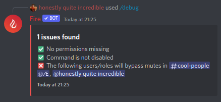

## Sunday, June 14 2020

### Edits With Paginators

When editing a command message where both the old and new commands used paginators, Fire will now forget the old paginator instead of switching between the two upon reacting.

### Guild Command Redesign

The `$info guild` command has gotten a redesign! It now looks nicer and has many more aliases (`guild, infoguild, info guild, guildinfo, infoserver, serverinfo`)

## Tuesday, May 19 2020

### Delete Flag For Ban

You can now choose how many days worth of messages to delete when banning a user with the `--delete` flag (`-d` works too)\
Example: `$ban Aktimoose using deprecated regions --delete 1` to delete messages from the past day (max is 7 due to discord limits)

If the flag is omitted then no messages will be deleted.

## Sunday, May 17 2020

### New Link Filter

`shorteners`, enable with `$linkfilter shorteners`, deletes common short links, e.g. bit.ly

### Changes to moderation commands

Moderation commands no longer respond if `--silent` is used

## Tuesday, May 12 2020

### New Commands

`$badname` - Change the name used for auto dehoist/decancer. This will **not** change existing nicknames! `$autodecancer` - Toggle renaming those with "cancerous" (non-ascii) names. This will **not** rename existing users!\
`$autodehoist` - Toggle renaming those with hoisted names. This will **not** rename existing users!

### Changes you probably won't notice

Fire _should_ no longer log role removals for deleted roles. It may still log a few before the role is actually deleted but this should prevent logs being spammed in large guilds from removing a role that everyone has

## Monday, May 11 2020

### New Commands

`$reminders` - You can now see your reminders. This really should've been a thing from the start
`$delremind` - You can now delete your reminders. This really should've been a thing from the start (see screenshot for more info on how to delete a reminder)

### Changes you probably won't notice

The mute command will now delete mutes before attempting to removing the role, meaning tons of mutes don't build up in my database and people don't get muted if/when they rejoin (don't you just love people who leave after getting muted) even though their mute expired

## Sunday, May 10 2020

### Changed Commands

The `$info user` command has gotten a redesign! It now looks nicer and has many more aliases (`user, infouser, info user, userinfo, whois, u`)

### New Commands

`$antispam <chance of spam>`

Toggles ChatWatch spam prevention. If messages have a chance of spam greater than or equal to the chance provided in this command, they will be deleted.

**THIS HAS BEEN ENABLED BY DEFAULT WITH AN 80% CHANCE OF SPAM FOR GUILDS WITH AT LEAST 1000 MEMBERS!**

## Saturday, May 9 2020

### New Commands

`$slowmode <delay> [<channel/category>]` - Set slowmode in the current channel, another channel or a category\
`$ghstatus` - Check GitHub's status\
`$cfstatus` - Check Cloudflare's status

### Removed Commands

`$hyperium`, `$fetchchannel`, `$fetchactivity`

### General Updates

Fire will now automatically set it's status on [https://status.gaminggeek.dev/](https://status.gaminggeek.dev) depending on it's ping.

## Friday, April 3 2020

### New Debug Command

If you do `$debug <command>` Fire will go through some common things that may prevent a command from running (global checks, permissions, whether the command is enabled or not) and give a list of issues if any are found. This should help with figuring out small issues so if some command stops working, use the debug command and if the debug command stops working, seek immediate help [here](https://inv.wtf/fire)

## Thursday, April 2 2020

### Changes to public servers

To ensure that people cannot scrape the invites from the page, you will now have to solve a captcha to get redirected to the invite. This is to prevent abuse of the page and to ensure your server is protected from potential spam bots joining.

## Wednesday, April 1 2020 (I promise it's not a prank)

### **Changes to Vanity URLs for better consistency**

For the past few months, Vanity URLs have been accessible through many domains, with the 2 main ones being `oh-my-god.wtf` and `inv.wtf`. The latter however was only available to Fire+ guilds and also had support for custom redirects. Starting from today, **inv.wtf is the only main domain for Vanity URLs and will eventually be the only domain they're accessible from**

This change means that even non-plus guilds will be able to use this domain for their Vanity URLs (redirects are still Fire+ only) and the other 5 domains will eventually be phased out and no longer function.

This is for better consistency with Vanity URLs, less hassle for other bots to be keeping up with what domains Fire vanity URLs are accessible from to filter them if they choose to do so and finally as a cost saving measure. I don't have a job and the only way for me to keep Fire up and running pretty much 24/7 is the wonderful people who have supported Fire by purchasing plus \<3

I'd like to thank you all for using Fire and hope you enjoy these new updates :D

## Wednesday, March 18, 2020

### Bug fixes and changes to command handling

First we have bug fixes, my favorite. `--remind` now actually works which is nice and (not that it matters to any of you) my logs are no longer spammed with errors when starting Fire :D

Anyways, actual cool things now. Fire has been able to run commands when you edit your message for a long time now, but as of about an hour ago during the maintenance, Fire will now edit the response from the old command too! **This won't work for any commands that use files due to a Discord limitation**

If you have suggestions for Fire, feel free to use the `$suggest` command to let me know about 'em. I will start working on suggestions in the next few days as I've sorta been neglecting them

## Thursday, March 12, 2020

### Configurable muted role

You can now set the muted role Fire uses when muting users! Just use the command `$muterole [<role>]` to set it.

If you don't provide a role, Fire will reset it and just use a role called "Muted" and if it's not found, it will create one.

## Friday, March 6, 2020

### Removal of music

Important update for those who make use of Fire's music feature!

Due to many reasons (Lavalink being a piece of trash, YouTube blocking Fire's IP many times, Lavalink being a piece of trash), I have removed Fire's music feature completely. This will free up a lot of resources on Fire's VPS as Lavalink is quite resource intensive, with ram usage in excess of 1.5GB at times, which will allow for more expansion.

Fire was never made to be a music oriented bot and music was always a low priority. I have not changed anything related to music since January 10th as Fire's music has been considered "deprecated" since then.

If you used Fire's music feature, I'd recommend switching to Groovy ([https://groovy.bot/](https://groovy.bot)) for all your music needs (and keep Fire for it's other features of course). As Groovy is a bot specifically for music playback, you will have a better experience with it.

Thank you for using Fire and I apologize for any inconvenience caused by this removal.

## Wednesday, February 26, 2020

### Update to snipes

hi i did the same as quotes but for snipe and esnipe and you can only snipe a message once now. once it's sniped, it get's yoinked from fire's memory ok thanks bye

_such a professional update changelog thing_

## Sunday, February 23, 2020

### Quotes

oh hey a new fea- wait a minute, this isn't new!

That's right, I have rewritten an existing feature and made it cooler :D Fire's quote command (and auto quoting, `$quote auto` to enable) now has it's own file and a new addition.

If in a channel where Fire has `Manage Webhooks` permission, it will make use of this to make quotes cooler. It will show kinda like the user themselves repeated their message, except there's a **BOT** tag because it's a webhook. It will use an existing webhook or create one if none exist in that channel. **Tip:** If you want to go back to the old quotes, just remove `Manage Webhooks` from Fire (and `Administrator` if applicable) and it will be like nothing changed!

I hope you enjoy this new addition to quoting because I personally love it. If you encounter any issues, please let me know in [#help](https://inv.wtf/geek) or if you have a suggestion, use the `$suggest` command

## Friday, February 21, 2020

### Tickets

Today I am releasing Fire's newest feature, tickets! With this new feature, members of your Discord can create tickets for whatever reason they would need it. For tickets to be created, they must be enabled which can be done by setting a category using `$tickets category`. You can see all the configuration commands for tickets by using `$tickets`.

The main commands for tickets are;

`$new` - Opens a ticket\
`$add <user>` - Adds a user to the current ticket\
`$remove <user>` - Removes a user from the current ticket\
`$close` - Closes the current ticket

### Feature removal

Along with this new feature, we say goodbye to an old one. Fire's muted chat is now removed and Fire will no longer add users to it or set permissions for read messages to false in other channels. To reconfigure Fire's permissions for the Muted role, just delete it and mute someone to recreate it. This was a feature that quite a few people did not like and many did not even use so I made the decision to remove it. I don't see it ever coming back so if you liked it then I apologize for the inconvenience.

## Wednesday, February 19, 2020

### Command removal

The `tempmention` command has been removed. This is due to a recent Discord update that makes it kinda pointless. If you are unaware about the new update, anyone with `Mention Everyone` permission can now mention all roles without needing to change the mention toggle. If you don't see this, make sure to update your client.

## Wednesday, January 22, 2020

### Quoting changes

Fire will now find any image link in the message you are quoting, remove it from the message content and set it as the embed's image so that you don't need to click the link to see it

## Wednesday, January 15, 2020

### Rewrite merge

- Merged parts of the rewrite into [master](https://github.com/GamingGeek/Fire)

<Callout type="info">
This isn't too big of an update for your average Joe, but in terms of the code base, the "core" is much cleaner an allows for more modularity with commands, events and core modules such as Chatwatch
</Callout>

## Saturday, January 11, 2020

### The reminders update

Fire now has reminders!

Fire can give you a reminder for anything and everything right in your DMs. There's two ways to set a reminder with Fire, a command or a flag.

With the command, you just do `$remind <your reminder here> <time>` e.g.`$remind fix logging in 1 hour`

The flag is an easy way to set a reminder by just adding `--remind` to your message. For example, I can do `I need to clean my room --remind 1 hour` and Fire will remind me to clean my room in an hour.

My favorite part of reminders is the support for message URLs. Place a message URL in your reminder and when it's time to be reminded, Fire will quote these messages along with your reminder.

Hope you all enjoy this feature as I had a lot of fun making it :)

<Callout type="info">
Fire uses regex to find the time and replace it when giving you your reminder. It will attempt to catch phrases like `in 1 hour` or `that <reminder>` but sometimes it will do an oopsie and not get your time right. It's best to stick to using `1 day 2 hours 3 minutes 4 seconds` as the format.
</Callout>
