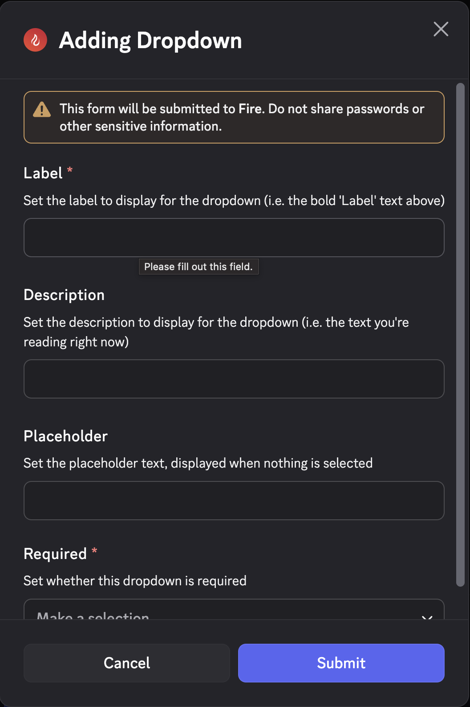
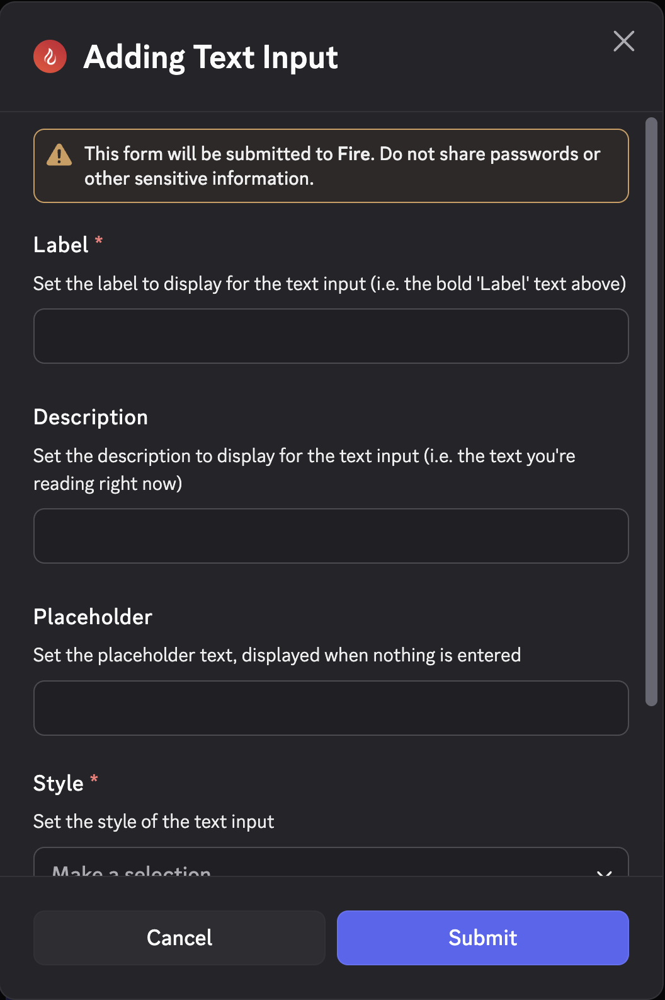
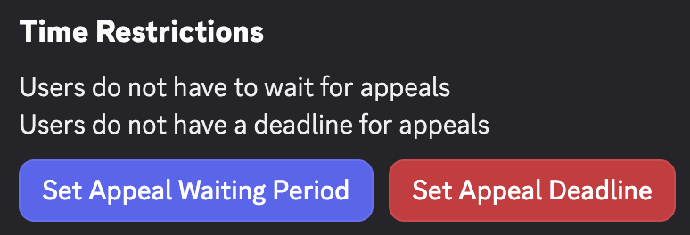
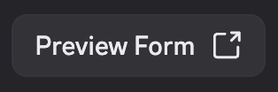
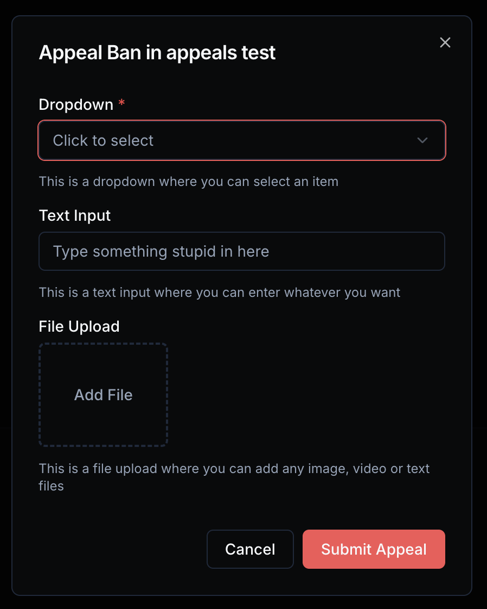
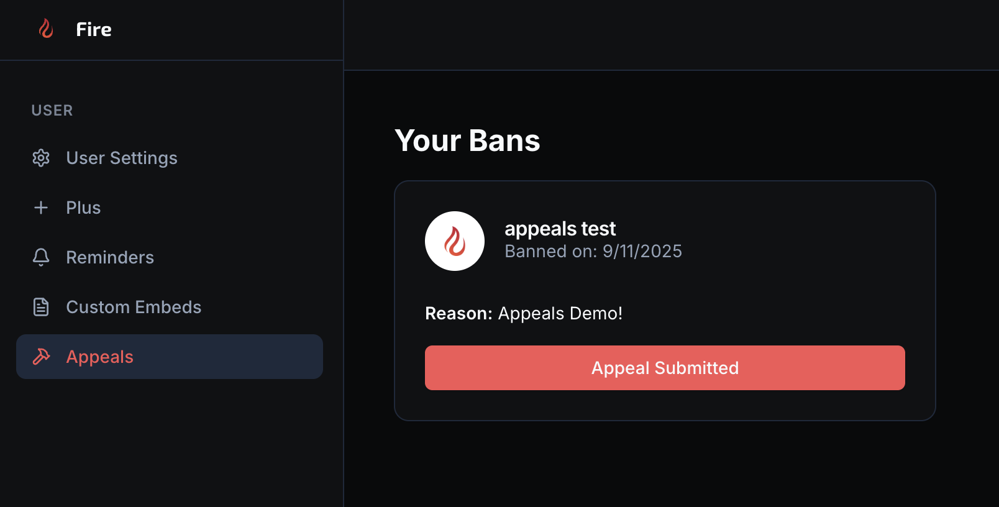
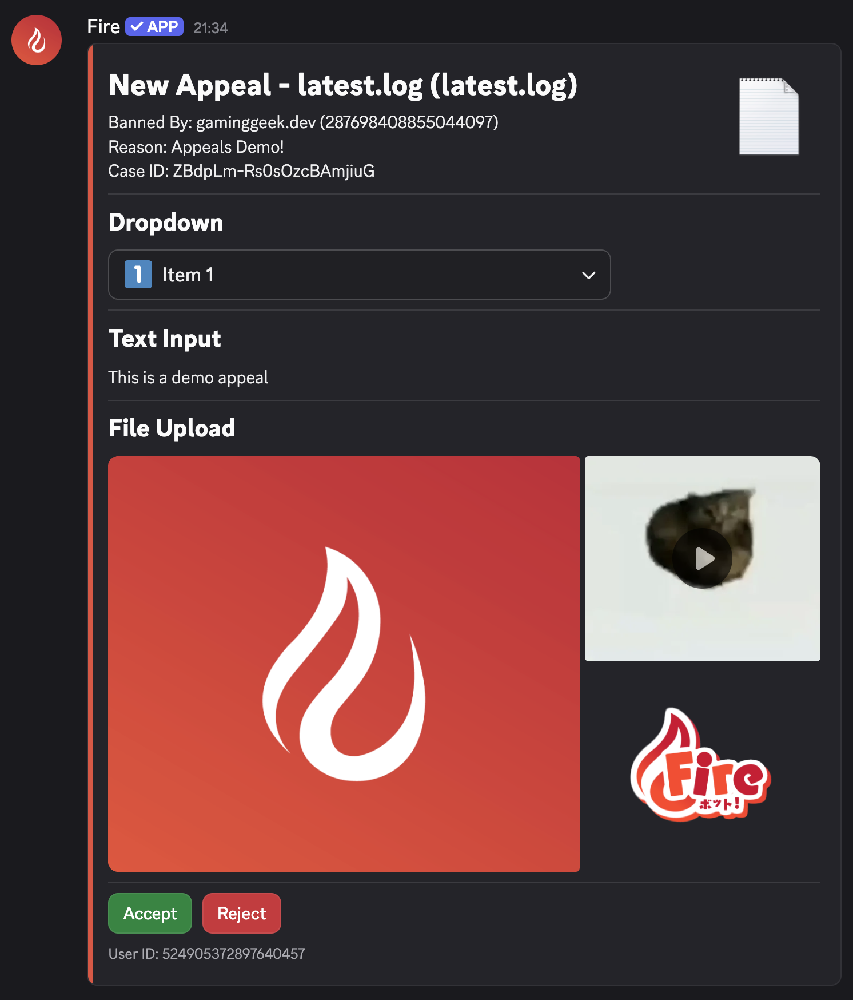
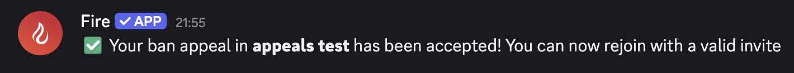

If you've ever had users asking to be unbanned, you'll know that they often take various less-than-ideal methods to do so if you don't have a proper appeal system set up, which is where Fire comes in, allowing you to build a custom form for ban appeals that users can fill in when they get banned and be sent straight into your server!

## Enabling Appeals

Everything to configure appeals can be done via the `/appeals` command, using the brand new components v2 from Discord to display an embed-like box with dropdowns and buttons

To enable appeals, you must first select a channel to send appeals to then add at least one form item, which you can do by selecting a channel from the dropdown list and then using the `Add Form Item` button

## Adding Form Items

Form items come in 3 different types: `Dropdown Menu`, `Text Input` & `File Upload`

### Dropdown Menu

With a dropdown menu, users can select an item from a list of options as part of their appeal

<Callout type="warn">
Currently, only one item can be selected per dropdown menu so keep this in mind when building your appeal form
</Callout>

### Text Input

Adding a text input allows users to enter any text they'd like, up to 4000 characters, in two styles: `Short` and `Paragraph`

### File Upload

File uploads allow users to attach text, image & video files to their appeal, up to 8MB in size

## Time Restrictions

In the time restrictions section, you can set a "waiting period" and deadline for appeals, preventing users from appealing too soon after their ban or too long after they've been banned

## Previewing your form

Using the `Preview Form` button at the bottom of the appeals container, you can see what your newly built appeal form will look like for someone submitting a ban appeal

This button will redirect you to the Fire website to view the form, looking like the one below:

## Submitting an appeal

If you've been banned from a server and wish to appeal, you have two ways of doing so

### Ban Message

If you had your DMs enabled at the time of your ban, you should have received a message like this with a handly button to go submit an appeal

<Callout type="info">
The button will only display if appeals are enabled in the server and the bot was successfully able to generate an ID for your appeal.
</Callout>

Clicking this button will go to the Fire website and immediately open the appeal form, no login required, allowing you to easily submit a ban appeal

### Dashboard

If you did not receive the ban message or an appeal button was not attached to it, don't fret, you still have the dashboard available to you!

By logging in on the [Fire website](https://getfire.bot/), you can open the dashboard and select `Appeals` in the sidebar to view any bans that can be appealed

Clicking the `Appeal` button on a ban will open the server's appeal form just like the button on the ban message would.

Any bans you've already submitted an appeal for will display `Appeal Submitted` on the button (though clicking the button won't do anything)

## Answering an appeal

When a user submits an appeal, Fire will send a message in your selected channel with details about their ban and the answers they gave in the form

Moderators can submit a decision for the appeal using the two buttons at the bottom, with the accept button automatically unbanning the user

## What happened to my appeal?

If you've submitted an appeal, there are two ways to know the decision made by a moderator

### Direct Message

If you still share a server(s) with Fire and have DMs enabled, you will receive a message stating the decision, such as the following if it was accepted

### Dashboard

The dashboard can display all states of an appeal, including if it was denied. Accepted appeals will not be included in the list as it only displays servers where you have an existing ban

If your appeal was denied, the `Appeal Submitted` button will change to `Rejected`

## Questions & Feedback

Have any questions or feedback regarding this feature? We'd love to hear 'em!

Head on over to the [Fire Discord](https://inv.wtf/fire) and share it in the `#fire-help` channel or shoot us an email at `appeals@getfire.bot`

