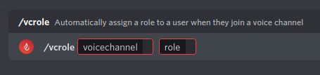
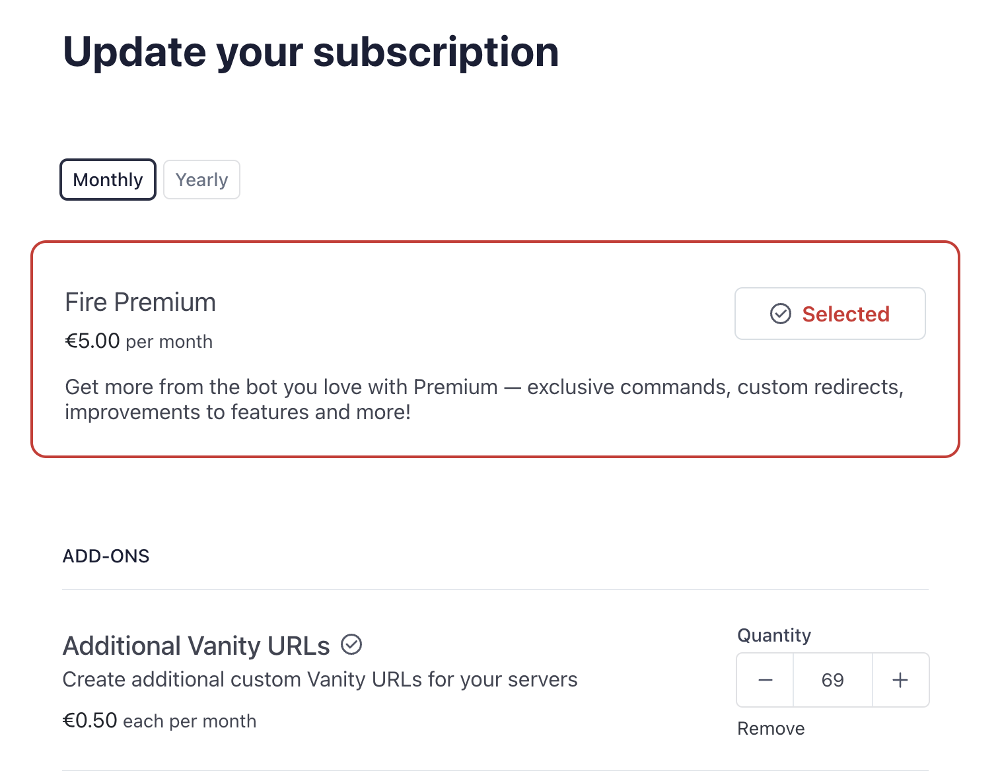
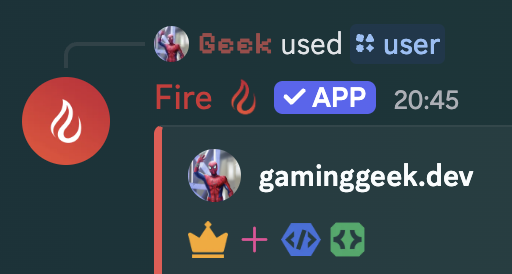
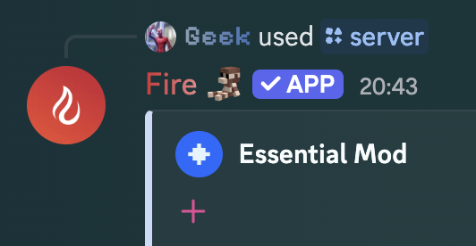

## What is Fire+?

Fire+ is an extension to Fire that gives extra features for a small cost. Subscribing to plus helps me pay the bills and keep Fire running with (as of writing) 99.99% uptime.

## Commands

### **Invite Roles**

Invite roles allow you to automatically give users a role depending on what invite they used to join. You can enable/disable it with the following command

(To disable use the command again with the same invite and same role. For invite, use the code itself or discord.gg URL)

### **Voice Channel Roles**

Voice Channel Roles allows you to link a role to a voice channel, meaning members in the voice channel will receive the role when they join and lose it when they leave.

### Identity

The identity commands allow you to change Fire's server profile, including bio, avatar & banner, helping you make Fire fit better with your server's branding

## Other features

### **Used Invite**

See what invite a user used when they joined.

If the user either 1. hasn't joined using an invite or 2. the invite is unknown, it will suggest preview mode/server discovery if applicable (Preview requires a discoverable guild)

<Callout type="warn">
Due to Discord not actually giving this information, it may not always be correct but has shown a high success rate when finding the used invite.
</Callout>

### **Vanity URL Stats**

With Fire+, you will be able to see the statistics of your server's Vanity URL created by Fire (`/vanity view`). Stats are tracked for all servers but you need plus to view them

### **Additional Vanity URLs**

Add extra Vanity URLs to your subscription that you can use across your servers alongside the free vanity included for each server. These can be useful if your server goes by multiple names or if you rename your server and wish to keep your old vanity

These can be added to your subscription via the [billing portal](https://inv.wtf/billing) (login with your Discord email or access it via the [Fire Website](https://etfire.bot/dashboard/plus)) through the `Update Subscription` button

### **Custom Redirects**

Using the same `inv.wtf` domain as Vanity URLs, you can create redirects to other websites, e.g. `https://inv.wtf/plus` redirecting to this page

This also includes stats similar to Vanity URLs. You can create 5 redirects per plus server that you have

### **Unlimited Tags**

By default you are limited to 20 tags but with plus, this limit is removed altogether.

<Callout type="warn">
You will only be able to have up to 100 slash command tags. This limit is imposed by Discord and cannot be changed or removed
</Callout>

### **Unlimited Permision Roles**

By default you can only sync one role's permissions to all channels. With plus, this limit is removed and you can have up to 100 permission roles!

### **Minecraft Log Scanning**

If you're a Minecraft player or have a server about Minecraft (specifically Java Edition) and hate when you crash or encounter issues, this feature is for you!

With this, Fire will check for Minecraft logs/crash reports in messages and if it finds one it will remove potentially sensitive information and provide possible solutions and recommendations.

This is a very popular feature and it is finally available to the general public with plus and can be enabled with `/minecraft log-scan`

<Callout type="warn">
This feature collects some data to better understand usage of this feature and to improve it further down the line.

\
If you enable this feature, you must make the members of the server, both existing and new, aware of this! They can learn more (including how to opt out) [here](../notices/mclogs-analytics.md)
</Callout>

### **Doubled Limits**

With Fire+, limits in various parts of Fire are doubled!
- Quotes (5 links/message -> 10 links/message)
- Iterable Quotes (5 extra messages -> 10 extra messages)
- Embeds (5 custom embeds -> 10 custom embeds)

### **Fire+ Badge**

Show off to your friends that you are supporting the best bot with the fancy plus badge in the `/user` command. Each server you give plus to will _also_ have a plus badge in the `/guild` command!

### **Priority Support**

If you're having issues with Fire and ask in the #plus-support channel in [Fire's discord](https://inv.wtf/fire), you will get faster support.

### **Priority Suggestions**

Suggestions made on the GitHub repo will be prioritized for Fire+ users. Make sure you have your GitHub linked to your Discord account & are in the [Fire Discord](https://inv.wtf/fire) so I can see who owns the GitHub account.

## Where the money goes

The money received from plus supporters goes right back to Fire via paying for the VPS every month. If there's a time when I can afford to pay for the VPS and have left over cash, it will go towards paying for things related to Fire, e.g. error tracking ([Sentry](https://sentry.io)), domains and anything else that will benefit Fire.

## How much is it and where do I purchase it?

Fire+ has a base price of €5/mo OR €40/yr for one server with additional servers being €1.50/server/mo OR €12/server/yr with up to 199 extra servers being available as an addon for your subscription.

<Callout type="warn">
You cannot mix monthly & yearly payments so if you pay for plus yearly, you must also pay for all add-ons yearly! Changes to addons will also take effect immediately and removing an add-on will credit a pro-rated amount to your account 
</Callout>

You can purchase Fire+ on the [Fire website](https://getfire.bot/) by logging in, opening the dashboard by selecting your avatar then `View Dashboard` and clicking `Plus` in the sidebar.

Payments are handled by [Stripe](https://stripe.com/) and are subject to our [refund policy](../important/refunds.md).

If you have any questions, feel free to ask in the [Fire Discord](https://inv.wtf/fire)

## Discounts

Discounts are offered to members of the [Fire Discord](https://inv.wtf/fire) and can range from 10% off to 75% off, depending on your roles.

All server members are entitled to 10% off Fire+ just for being in the server! You can bump that discount up to 35% off by boosting the server

Subscribers to [the developer's Twitch](https://inv.wtf/twitch) can get 50% off if you have your Twitch account linked to your Discord and a combined subscriber & server booster can get a whopping 75% off! If you already pay for Discord Nitro & have Amazon Prime, that's an easy way to get a very cheap Fire+ subscription 😅

You can claim your special coupon code using the `/discount` command in the `#bot-commands` or `#testing` channels but you'll only see the code once and it will expire 24 hours after you run the command

<Callout type="error">
You must stay in the Fire Discord for the discount to continue. If you leave the server, your special coupon code will be invalidated and your subscription will renew at full price!
\
You must also keep your Twitch account linked to avail of the Twitch subscriber discounts. If your account is unlinked, your discount will be downgraded and you will lose the Twitch Subscriber role.
</Callout>