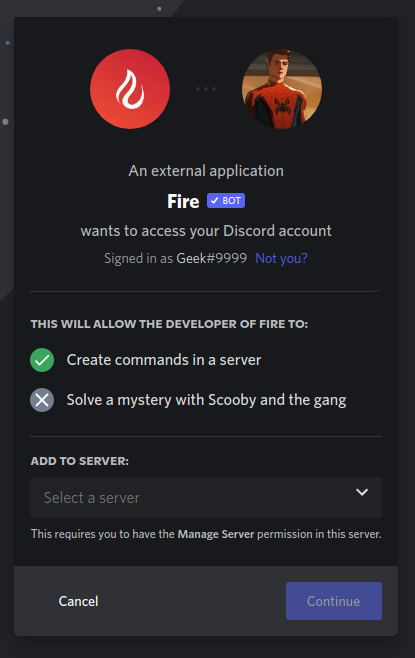

## Prerequisites

Make sure you have the `Manage Server` permission in the server you want to invite Fire to.

## How to invite?

Head to [inv.wtf/bot](https://inv.wtf/bot) in your browser. If you aren't signed into Discord on the web, you will be asked to do so. Once signed in, you will be greeted with the page below. Select a server, click Continue, review permissions then click Authorize and complete the Captcha. Voila! Fire is now in your server, ready to rock and roll.

<Callout type="warn">
By default, Fire requests enough permissions to the point where you shouldn't encounter any permission related errors. It is NOT recommended to give Fire administrator permissions in your server
</Callout>
