# Premium

## What is Premium?

Premium is an extension to Fire that gives extra features for a small cost. Subscribing to premium helps me pay the bills and keep Fire running with (as of writing) 99.97% uptime.

## Commands

### **Reaction Roles**

Reaction roles allows users to give themselves a role by reacting to a message with a specific emoji. Use the following command to set up a reaction role

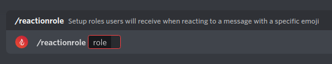

### **Invite Roles**

Invite roles allow you to automatically give users a role depending on what invite they used to join. You can enable/disable it with the following command

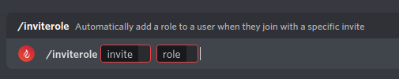

(To disable use the command again with the same invite and same role. For invite, use the code itself or discord.gg URL)

### **Ranks**

Ranks are roles that anyone can join by typing a command. The roles users can join are from a list of roles you add.

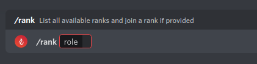
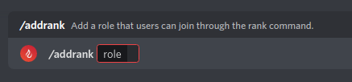
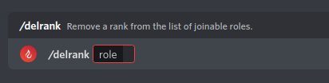


Adding & removing ranks requires `Manage Roles` permission, joining a rank does not require any permissions.


### **Role Persist**

Role Persist allows you to give a user a role and ~~shove it down their throat~~ make sure they keep it, even if they leave and rejoin!

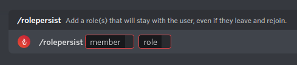

### **Voice Channel Roles**

Voice Channel Roles allows you to link a role to a voice channel, meaning members in the voice channel will receive the role when they join and lose it when they leave.

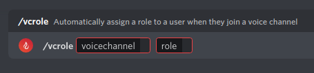

## Other features

### **Used Invite**

See what invite a user used when they joined.

If the user either 1. hasn't joined using an invite or 2. the invite is unknown, it will suggest preview mode/server discovery if applicable (Preview requires a discoverable guild)

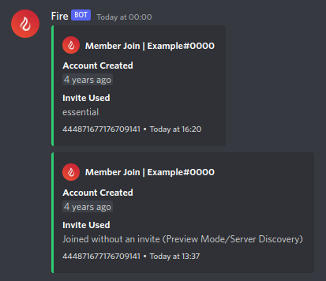


Due to Discord not actually giving this information, it may not always be correct but has shown a high success rate when finding the used invite.


### **Vanity URL Stats**

With premium, you will be able to see the statistics of your server's Vanity URL created by Fire (`/vanityurl`). Stats are tracked for all servers but you need premium to view them

### **Custom Redirects**

Using the same `inv.wtf` domain as Vanity URLs, you can create redirects to other websites, e.g. `https://inv.wtf/premium` redirecting to this page

This also includes stats similar to Vanity URLs. You can create 5 redirects per premium server that you have

### **Unlimited Tags**

By default you are limited to 20 tags but with premium, this limit is removed altogether.


You will only be able to have up to 100 slash command tags. This limit is imposed by Discord and cannot be changed or removed


### **Unlimited Permision Roles**

By default you can only sync one role's permissions to all channels. With premium, this limit is removed and you can have up to 100 permission roles!

### **Minecraft Log Scanning**

If you're a Minecraft player or have a server about Minecraft (specifically Java Edition) and hate when you crash or encounter issues, this feature is for you!

With this, Fire will check for Minecraft logs/crash reports in messages and if it finds one it will remove potentially sensitive information and provide possible solutions and recommendations.

This is a very popular feature and it is finally available to the general public with premium and can be enabled with `/minecraft log-scan`

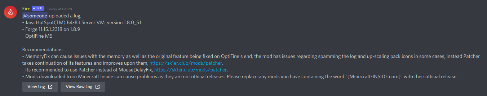


This feature collects some data to better understand usage of this feature and to improve it further down the line.

\
If you enable this feature, you must make the members of the server, both existing and new, aware of this! They can learn more (including how to opt out) [here](../notices/mclogs-analytics.md)


### **Doubled Auto Quote Limit**

Yet another raised limit and this time it's for auto quoting. Fire will only quote up to 5 message links from a single message but with premium, this gets doubled to 10. Have fun quoting :D

### **Premium Badge**

Show off to your friends that you are supporting the best bot with the fancy premium badge in the `/user` command. Each server you give premium to will _also_ have a premium badge in the `/guild` command!

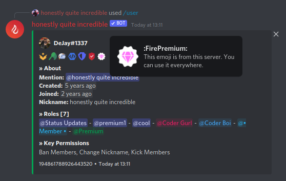

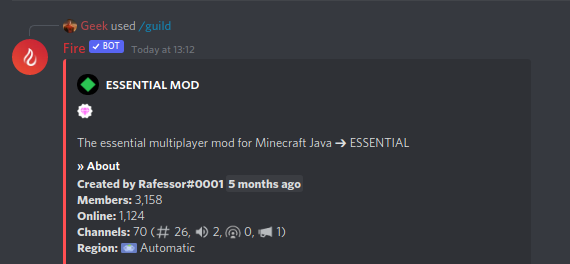

### **Priority Support**

If you're having issues with Fire and ask in the #premium-support channel in [Fire's discord](https://inv.wtf/fire), you will get faster support.

### **Priority Suggestions**

Suggestions made on the GitHub repo will be prioritized for Premium users. Make sure you have your GitHub linked to your Discord account & are in the [Fire Discord](https://inv.wtf/fire) so I can see who owns the GitHub account.

## Where the money goes

The money received from premium supporters goes right back to Fire via paying for the VPS every month. If there's a time when I can afford to pay for the VPS and have left over cash, it will go towards paying for things related to Fire, e.g. error tracking ([Sentry](https://sentry.io)), domains and anything else that will benefit Fire.

## How much is it and where do I purchase it?

The price for premium depends on the amount of servers. €5 for one server, €8 for 3 and €12 for 5.

You can purchase premium on the [Fire website](https://getfire.bot/) by logging in, clicking your profile picture in the top right and clicking `Premium`.

Payments are handled by Stripe and are subject to our [refund policy](../important/refunds.md).

If you have any questions, feel free to ask in the [Fire Discord](https://inv.wtf/fire)
