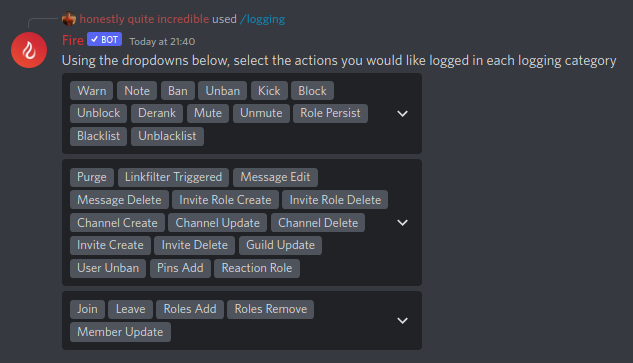
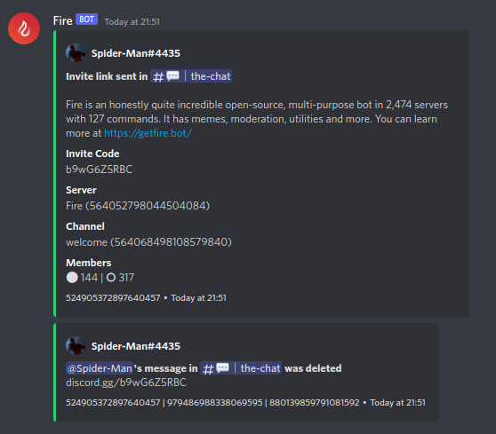
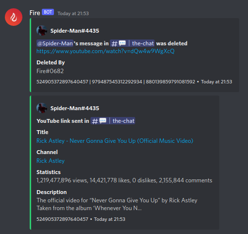
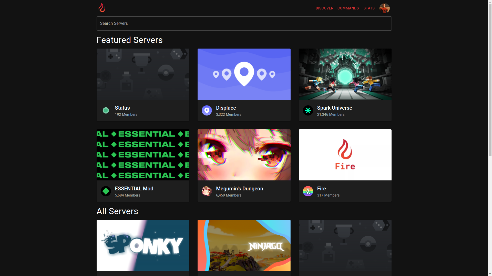

# Configuring Fire

## Setting Moderators

To use moderation commands _without_ the manage server permission, you must set moderators using the `/moderators add` command

This command can be used to add either a user or role as a moderator and can be used multiple times to add multiple users or roles.

Removing moderators can be done with the `/moderators remove` command and you can list current moderators using the `/moderators list` command


If you do not set moderators, only those with **Manage Server** will be able to use moderation commands as they are considered admins


## Enabling Logging

Fire provides 3 different types of logging: Moderation, Action & Members

All 3 can be toggled using the `/logging toggle` command.

You can configure what exactly gets logged by using the `/logging configure` command.

## Command Restrictions

### Disabling Commands

Sometimes you'll find a command you don't want users in your server to use. No worries, you can easily disable the command with the `command` command (great name, I know)

For example, do you want to disable the `meme` command to prevent users seeing memes that are too spicy for your liking?
Disable it with `/command meme`


Disabling a command restricts it's usage to moderators so even if a command is disabled, it can still be used by anyone added as a moderator or those with the `Manage Server` permission.


### Moderator Only Channels

Moderator only channels are channels where only moderators can run commands, quote messages via links and set reminders using the `--remind` flag.


**Manage Server** permission is required to set moderator only channels


### Administrator Only Channels

Similar to above, administrator only channels are channels where only administrators (users with **Manage Server** permission) can run commands, quote messages via links and set reminders using the `--remind` flag.


**Administrator** permission is required to set administrator only channels


## Languages

Fire includes support for multiple languages, however, `en-US` (default) and `en-GB` (en-US with slight changes) are the only two available

This can be changed either for just you or the whole server, depending on your permissions and where you run the command. If you have the **Manage Server** permission, the `language` command will set the language for the whole server (to set it for yourself, run the command in DMs), otherwise it will set your own language which will take priority over the server's language 

To set the language, use `/language <language>`
e.g. `/language en-GB`


You can help contribute to the translation of Fire by joining the [Fire Crowdin](https://inv.wtf/i18n) project


## Link Filters

Link filters in Fire allow you to prevent users from posting certain links, such as youtube videos or discord invites.

### Enabling Filters

To toggle filters, use the `/linkfilter toggle` command

### Adding Exclusions

There may be some users, roles or channels you would like to exclude from the filter. With the `/linkfilter exclude` command, you can easily exclude any of the three!

### Filter Logging

When a link filter is triggered, it will be logged in your action logs channel, if enabled. For most filters it'll just say which filter was triggered and who triggered it but some are special and include additional information about what was posted, such as the `youtube` & `discord` filters.

## Vanity URL

With Fire, you can create a custom Vanity URL through inv.wtf, e.g. [inv.wtf/fire](https://inv.wtf/fire)

This is perfect for sharing on social media or giving to friends as it gives a personal touch to the server and is shorter than any discord.gg link you could create.

## Public Server

Fire's website has a public servers page which you can shove your server into. Servers are shown to users in a random order and a captcha must be completed to access the invite to prevent scraping.

The public servers page uses the same invite as your Vanity URL (since it's the same code pretty much) so you'll need to have one before going public.

To make your server public, just run the `/public` command.
This requires the **Manage Server** permission.

## Auto Quotes

Fire's `quote` command allows you to quote a message using a message link. This can be handy to refer to old messages or even ones from a different server (provided the server has Fire)

When the quote command is enabled (which it is by default, but you can disable it with `/command`) you can make Fire find message links in any message and quote them.


The image above uses Fire's webhook quoting, which requires Fire to have the **Manage Webhooks** permission in the channel.

Auto quoting follows all command restrictions, e.g. users can't quote in moderator only channels without being a moderator & also follows permissions meaning they cannot quote a message they don't have access to.

